# Safe Control Density

This repository contains lightweight Python examples for density-based safe
control. The examples cover single-integrator navigation, unicycle navigation,
and racing-style density MPC.

## Quick Start

```bash
cd safe_control_density
python -m venv .venv
.venv/bin/activate
pip install -e .
python examples/single_integrator/static_single_obstacle/density_feedback.py
```

Optional nonlinear solver backends:

```bash
pip install -e ".[solvers]"
```

Solver flags are standardized across optimizer-based examples:

```bash
python examples/unicycle/static_single_obstacle/density_mpc.py --solver scipy_slsqp
python examples/unicycle/static_single_obstacle/density_mpc.py --solver jax_slsqp
python examples/unicycle/static_single_obstacle/density_mpc.py --solver casadi_ipopt
```

`auto` maps to the reproducible SciPy/SLSQP default.

## Main Results

### Single Integrator

The single-integrator examples use a planar point robot with directly commanded
velocity. Density MPC is not used for this simple model; the main comparison is
between direct density feedback, a one-step density filter, and a CLF-CBF
filter.

#### Static Single Obstacle

<table>
<tr>
<td align="center"><b>Density feedback</b><br>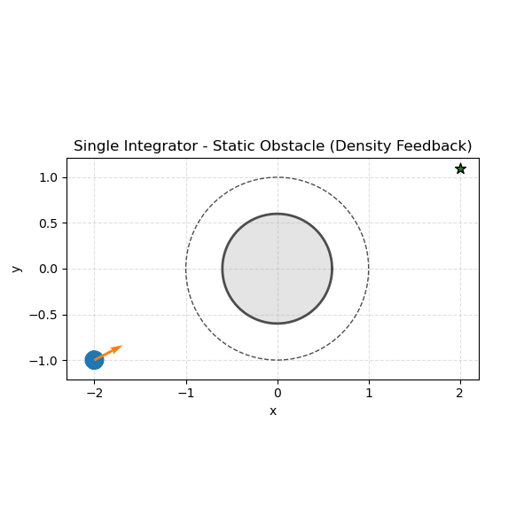</td>
<td align="center"><b>Density filter</b><br>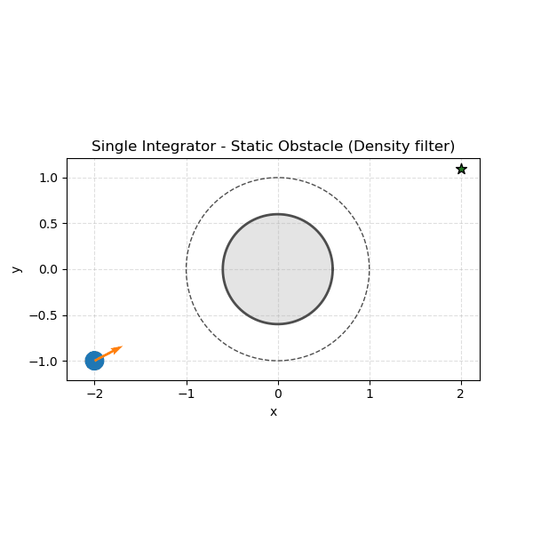</td>
<td align="center"><b>CLF-CBF filter</b><br>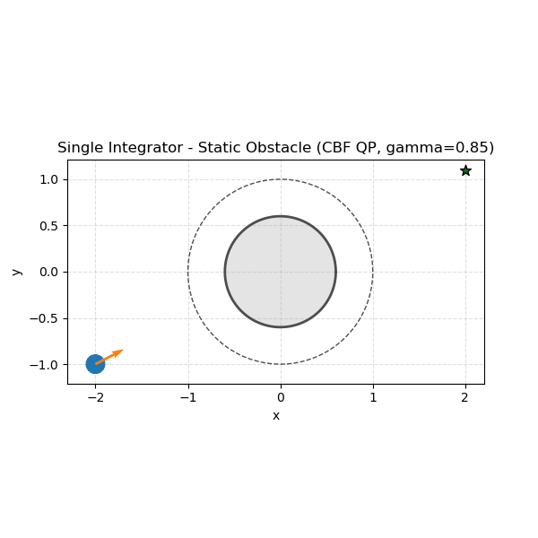</td>
</tr>
</table>

#### Multi-Obstacle And Local Sensing

The local-sensing case has density feedback and density-filter results. To keep
the overview balanced, this block also includes the static multi-obstacle
density-feedback rollout.

<table>
<tr>
<td align="center"><b>Static multi-obstacle density feedback</b><br>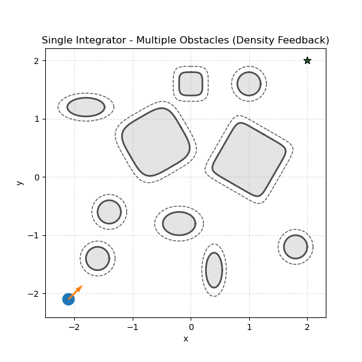</td>
<td align="center"><b>Local sensing density feedback</b><br>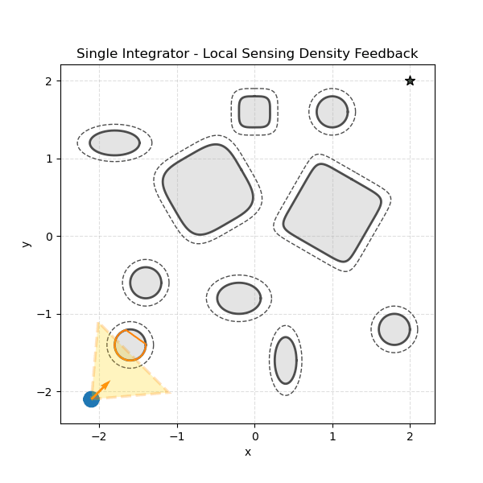</td>
<td align="center"><b>Local sensing density filter</b><br>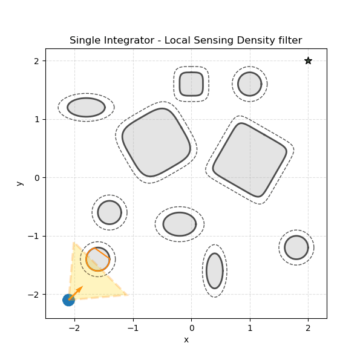</td>
</tr>
</table>

Full results: [single-integrator examples](examples/single_integrator/README.md)

### Unicycle

The unicycle examples use forward speed and yaw-rate inputs. The static
single-obstacle case compares density feedback, density filter, and density MPC
with the same obstacle geometry.

#### Static Single Obstacle

<table>
<tr>
<td align="center"><b>Density feedback</b><br></td>
<td align="center"><b>Density filter</b><br></td>
<td align="center"><b>Density MPC</b><br></td>
</tr>
</table>

#### Local Sensing

The local-sensing case uses the same three density controllers while limiting
which obstacles are active in the controller. The Density MPC result below uses
the reactive-FOV visualization.

<table>
<tr>
<td align="center"><b>Local sensing density feedback</b><br></td>
<td align="center"><b>Local sensing density filter</b><br></td>
<td align="center"><b>Local sensing density MPC with reactive FOV</b><br>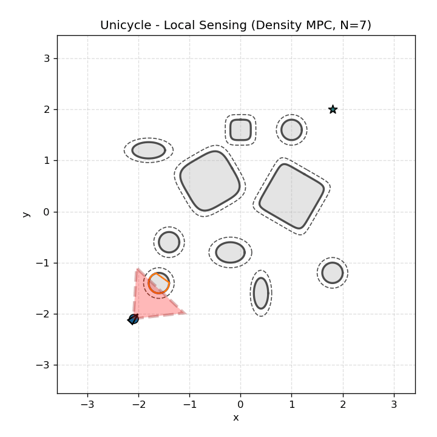</td>
</tr>
</table>

Full results: [unicycle examples](examples/unicycle/README.md)

### Multi-Agent Unicycle

The multi-agent examples compare reactive density feedback, collision cone
density feedback, and velocity-obstacle density feedback for teams of unicycle
agents swapping goals through crossing and ring-exchange layouts. Each
controller script is self-contained in its density construction and control law;
shared scenario setup lives in `examples/multi_agent/density_feedback/_config.py`,
and shared animation plotting lives in `examples/multi_agent/_plotting.py`.
The same nominal interaction models are also wrapped in density-filter and
density-MPC examples under `examples/multi_agent/density_filter/` and
`examples/multi_agent/density_mpc/`.

Run the two implemented controllers with:

```bash
python examples/multi_agent/density_feedback/reactive.py --scenario crossing6
python examples/multi_agent/density_feedback/collision_cone.py --scenario crossing6
python examples/multi_agent/density_feedback/velocity_obstacle.py --scenario crossing6
```

Representative animations:

<table>
<tr>
<td align="center"><b>Crossing 6 - Reactive density feedback</b><br>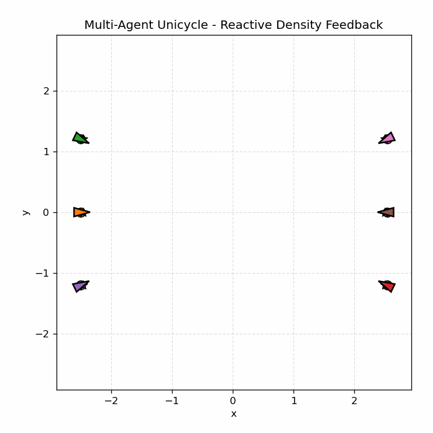</td>
<td align="center"><b>Crossing 6 - Collision cone density feedback</b><br>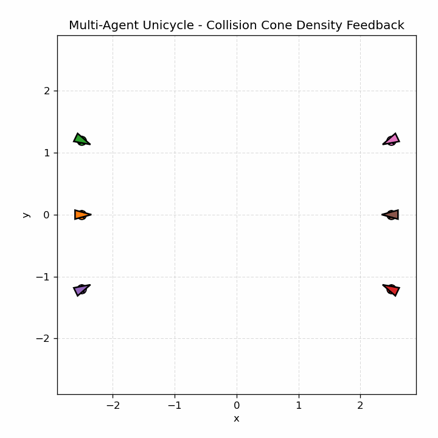</td>
<td align="center"><b>Crossing 6 - Velocity obstacle density feedback</b><br>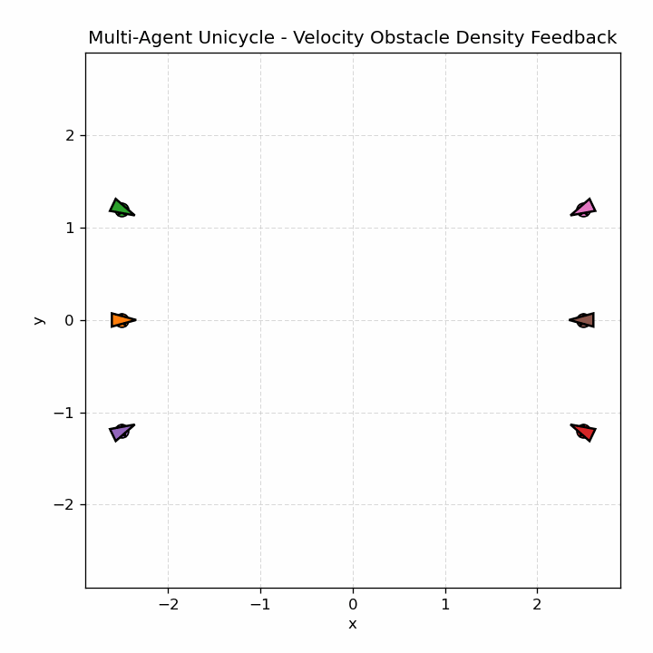</td>
</tr>
<tr>
<td align="center"><b>Opposite swap 8 - Reactive density feedback</b><br>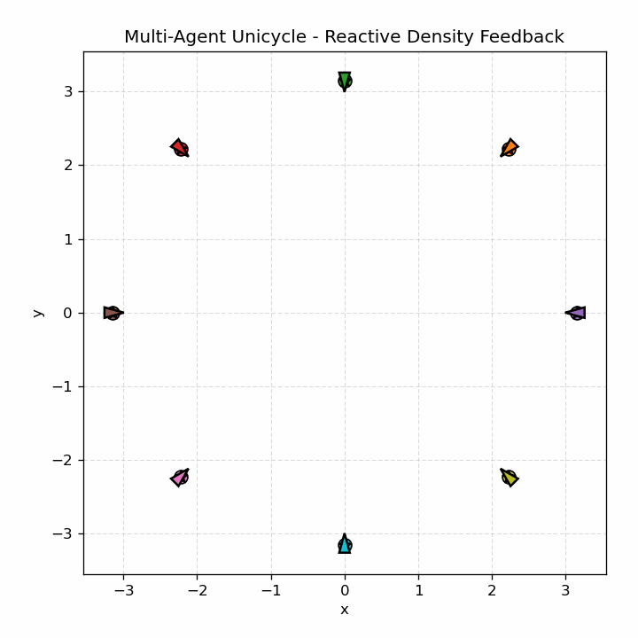</td>
<td align="center"><b>Opposite swap 8 - Collision cone density feedback</b><br>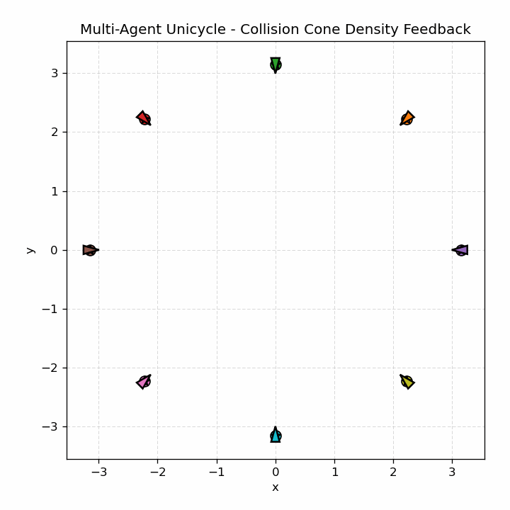</td>
<td align="center"><b>Opposite swap 8 - Velocity obstacle density feedback</b><br>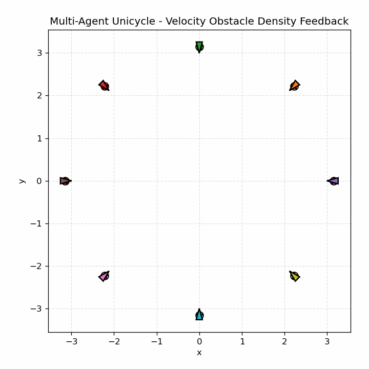</td>
</tr>
</table>

Available scenarios are `crossing2`, `crossing4`, `crossing6`, `swap8`,
`swap8_opposite`, `swap10`, and `swap12`. Generated GIFs are saved in
family subfolders under `examples/multi_agent/animations/`.

Full results: [multi-agent examples](examples/multi_agent/README.md)

### Dynamic Obstacles

The dynamic-obstacle examples test one unicycle robot moving through exogenous
moving disk obstacles. They compare reactive bump density, collision-cone
density, and velocity-obstacle density under density feedback and one-step
density filtering. The scenarios include a random-flow traversal, a
closing-in obstacle setup, a denser cluttered flow, and a streaming-flow route
that spawns randomized moving obstacles ahead of the robot.

```bash
python examples/dynamic_obstacles/density_feedback/velocity_obstacle.py --scenario random_flow
python examples/dynamic_obstacles/density_filter/velocity_obstacle.py --scenario closing_in
```

<table>
<tr>
<td align="center"><b>Random flow - VO feedback</b><br></td>
<td align="center"><b>Random flow - VO filter</b><br></td>
</tr>
<tr>
<td align="center"><b>Closing in - collision cone feedback</b><br>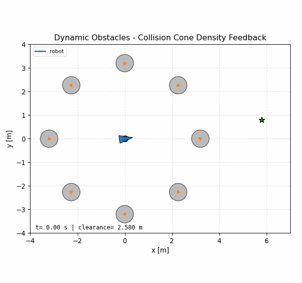</td>
<td align="center"><b>Closing in - collision cone filter</b><br>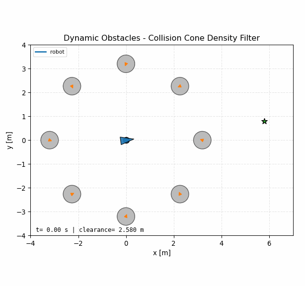</td>
</tr>
<tr>
<td align="center"><b>Dense flow - VO feedback</b><br>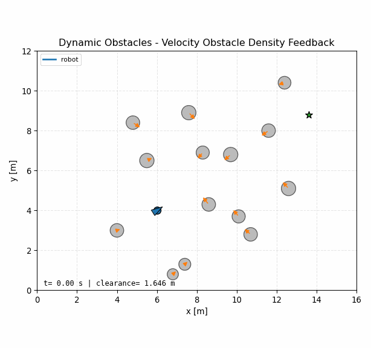</td>
<td align="center"><b>Dense flow - VO filter</b><br>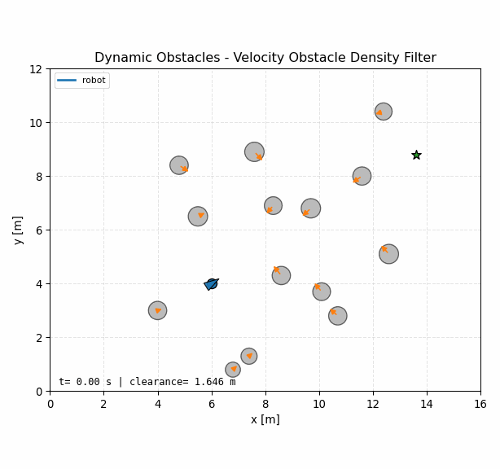</td>
</tr>
<tr>
<td align="center"><b>Streaming flow - VO feedback</b><br></td>
<td align="center"><b>Streaming flow - VO filter</b><br></td>
</tr>
</table>

Full results: [dynamic-obstacle examples](examples/dynamic_obstacles/README.md)

### Racing

The racing example uses a track-coordinate vehicle model with steering and
acceleration inputs. Density MPC-CDF tracks an L-shaped circuit while avoiding
moving obstacle cars.

<table>
<tr>
<td align="center"><b>Density MPC-CDF</b><br></td>
</tr>
</table>

Full results: [racing examples](examples/racing/README.md)

### Maze Navigation

The maze example is a pure-Python hierarchical navigation testbed for a
unicycle robot. It plans with A*, converts maze walls into merged rectangular
obstacles, wraps rectangle clearance in a smooth density bump, and compares
density feedback, a one-step density filter, and density MPC across eight
two-cell-gap maze scenarios.

<table>
<tr>
<td align="center"><b>Maze 1 - Density feedback</b><br>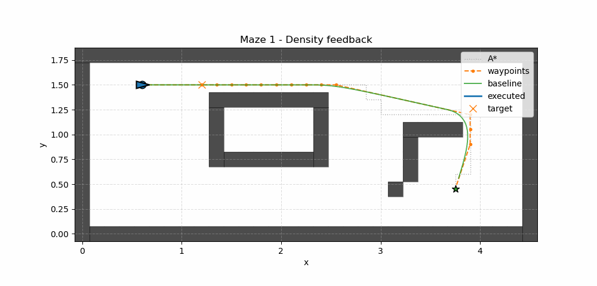</td>
<td align="center"><b>Maze 1 - Density filter</b><br></td>
<td align="center"><b>Maze 1 - Density MPC</b><br>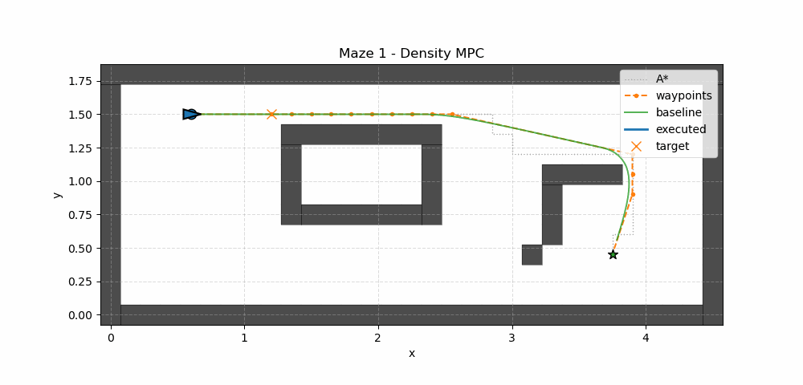</td>
</tr>
<tr>
<td align="center"><b>Maze 2 - Density feedback</b><br></td>
<td align="center"><b>Maze 2 - Density filter</b><br>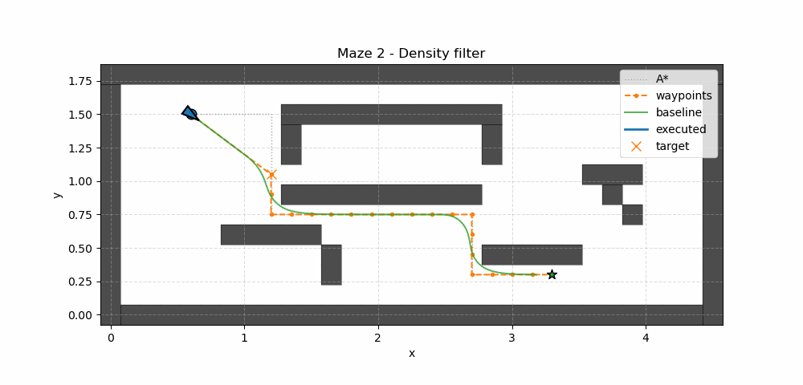</td>
<td align="center"><b>Maze 2 - Density MPC</b><br></td>
</tr>
</table>

Full results, including all GIF/MP4 files and the current success matrix:
[maze examples](examples/maze/README.md)

## Unicycle Safety-Filter Comparison

The unicycle example highlights a useful limitation of one-step discrete
CLF-CBF filters. For a kinematic unicycle,

$$
p_{k+1} = p_k
+
\Delta t\,v_k
\begin{bmatrix}
\cos\theta_k\\
\sin\theta_k
\end{bmatrix},
\qquad
\theta_{k+1}=\theta_k+\Delta t\,\omega_k .
$$

For a circular obstacle centered at \(p_o\), the barrier is

$$
h(z_k)=\lVert p_k-p_o\rVert^2-R^2 .
$$

The one-step discrete CBF condition is

$$
h(z_{k+1})\ge (1-\gamma)h(z_k).
$$

Substituting the Euler unicycle position update gives

$$
\left\lVert
p_k
+
\Delta t\,v_k
\begin{bmatrix}
\cos\theta_k\\
\sin\theta_k
\end{bmatrix}
-p_o
\right\rVert^2
-R^2
\ge
(1-\gamma)
\left(
\lVert p_k-p_o\rVert^2-R^2
\right).
$$

This one-step constraint depends on \(v_k\), but not directly on
\(\omega_k\). Steering changes \(\theta_{k+1}\), which only affects future
positions after another step. So the one-step CLF-CBF filter can slow down or
stop near the obstacle, but it cannot directly steer around it from the CBF
constraint. In the unicycle comparison, that filter remains safe but parks at
the obstacle, while the density filter, density MPC, and CBF MPC reach the
goal:


A two-step DCBF or short-horizon MPC-CBF resolves this relative-degree issue by
making future position depend on the current steering command.

## Repository Layout

- `density_utils/`: core density functions, dynamics, controllers, and plotting utilities
- `examples/single_integrator/`: point-mass density feedback/filter and CLF-CBF examples
- `examples/unicycle/`: unicycle density controllers, CBF controllers, and sensing-radius sweeps
- `examples/multi_agent/`: multi-agent unicycle density feedback comparisons
- `examples/dynamic_obstacles/`: moving-obstacle unicycle density feedback/filter examples
- `examples/racing/`: racing density MPC-CDF example
- `examples/maze/`: A*-planned maze navigation with rectangular wall-density obstacles

## Notes

- Examples print timing summaries such as `sim_time` and `avg_iteration`.
- Most scripts support `--save-gif`, `--no-plot`, and `--steps`.
- Long-horizon nonlinear MPC examples are for simulation studies, not hardware deployment.
