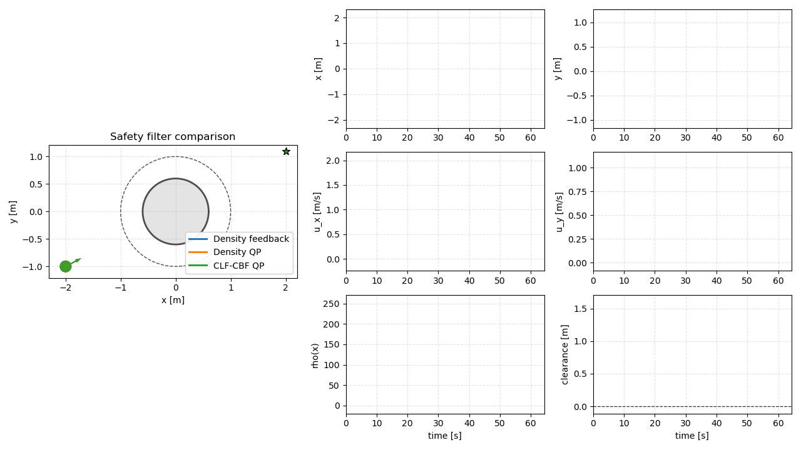
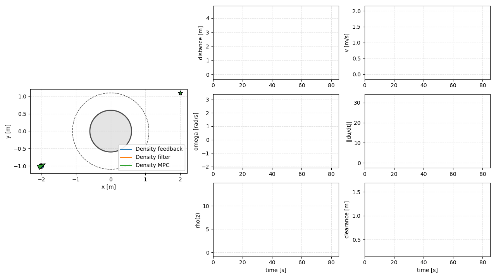
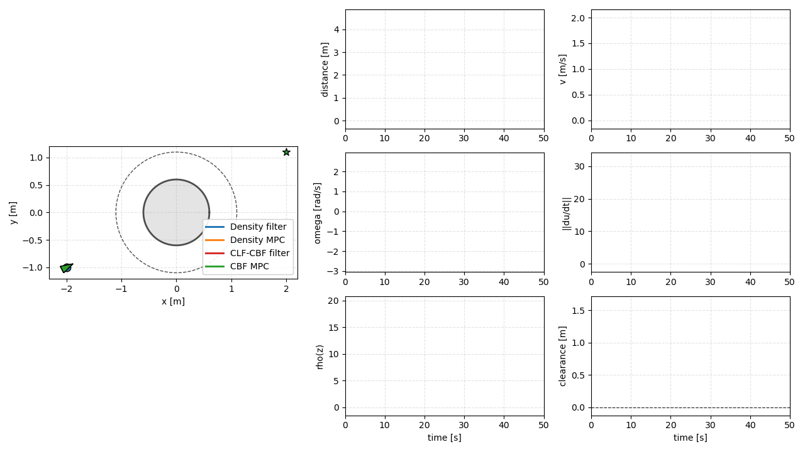

# Safe Control Density

This repository contains lightweight Python examples for density-based safe
control. The examples cover single-integrator navigation, unicycle navigation,
and racing-style density MPC.

## Quick Start

```bash
cd safe_control_density
python -m venv .venv
.venv/bin/activate
pip install -e .
python examples/single_integrator/static_single_obstacle/density_feedback.py
```

Optional nonlinear solver backends:

```bash
pip install -e ".[solvers]"
```

Solver flags are standardized across optimizer-based examples:

```bash
python examples/unicycle/static_single_obstacle/density_mpc.py --solver scipy_slsqp
python examples/unicycle/static_single_obstacle/density_mpc.py --solver jax_slsqp
python examples/unicycle/static_single_obstacle/density_mpc.py --solver casadi_ipopt
```

`auto` maps to the reproducible SciPy/SLSQP default.

## Main Results

### Single Integrator

A planar point robot with directly commanded velocity is tested with static
obstacles, multiple obstacles, and local sensing. Density feedback gives a
closed-form correction, while the density filter solves a one-step constrained
controller.



Full results: [single-integrator examples](examples/single_integrator/README.md)

### Unicycle

A planar unicycle with forward speed and yaw-rate inputs is used to compare
density feedback, density filter, density MPC, CLF-CBF filtering, and CBF MPC.



Full results: [unicycle examples](examples/unicycle/README.md)

### Racing

A track-coordinate racing model with steering and acceleration inputs uses
density MPC-CDF to track an L-shaped circuit while avoiding moving obstacle
cars.


Full results: [racing examples](examples/racing/README.md)

## Unicycle Safety-Filter Comparison

The unicycle example highlights a useful limitation of one-step discrete
CLF-CBF filters. For a kinematic unicycle,

$$
p_{k+1} = p_k
+
\Delta t\,v_k
\begin{bmatrix}
\cos\theta_k\\
\sin\theta_k
\end{bmatrix},
\qquad
\theta_{k+1}=\theta_k+\Delta t\,\omega_k .
$$

For a circular obstacle centered at \(p_o\), the barrier is

$$
h(z_k)=\lVert p_k-p_o\rVert^2-R^2 .
$$

The one-step discrete CBF condition is

$$
h(z_{k+1})\ge (1-\gamma)h(z_k).
$$

Substituting the Euler unicycle position update gives

$$
\left\lVert
p_k
+
\Delta t\,v_k
\begin{bmatrix}
\cos\theta_k\\
\sin\theta_k
\end{bmatrix}
-p_o
\right\rVert^2
-R^2
\ge
(1-\gamma)
\left(
\lVert p_k-p_o\rVert^2-R^2
\right).
$$

This one-step constraint depends on \(v_k\), but not directly on
\(\omega_k\). Steering changes \(\theta_{k+1}\), which only affects future
positions after another step. So the one-step CLF-CBF filter can slow down or
stop near the obstacle, but it cannot directly steer around it from the CBF
constraint. In the unicycle comparison, that filter remains safe but parks at
the obstacle, while the density filter, density MPC, and CBF MPC reach the
goal:



A two-step DCBF or short-horizon MPC-CBF resolves this relative-degree issue by
making future position depend on the current steering command.

## Repository Layout

- `density_utils/`: core density functions, dynamics, controllers, and plotting utilities
- `examples/single_integrator/`: point-mass density feedback/filter and CLF-CBF examples
- `examples/unicycle/`: unicycle density controllers, CBF controllers, and sensing-radius sweeps
- `examples/racing/`: racing density MPC-CDF example

## Notes

- Examples print timing summaries such as `sim_time` and `avg_iteration`.
- Most scripts support `--save-gif`, `--no-plot`, and `--steps`.
- Long-horizon nonlinear MPC examples are for simulation studies, not hardware deployment.
