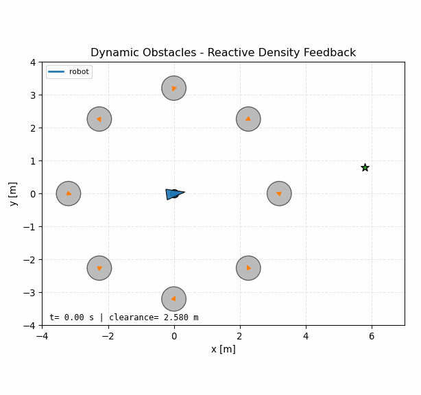
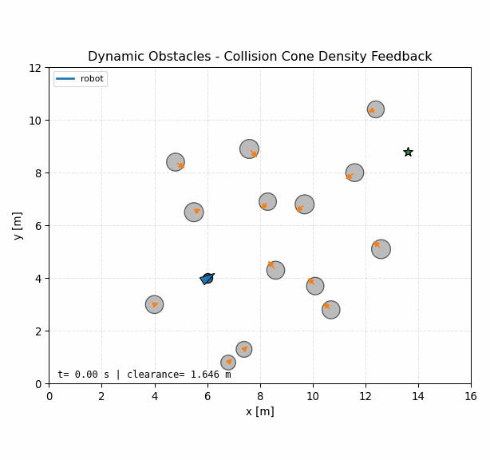
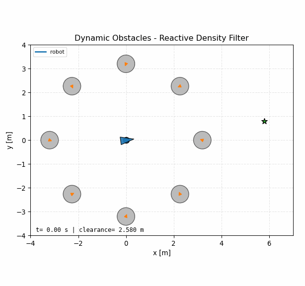
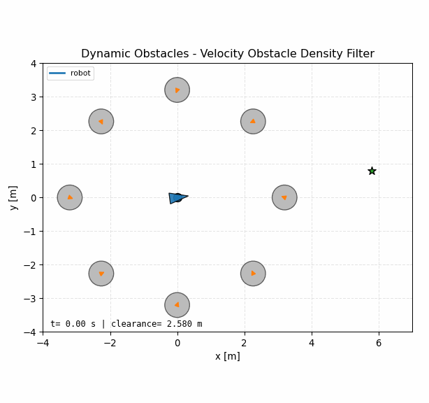
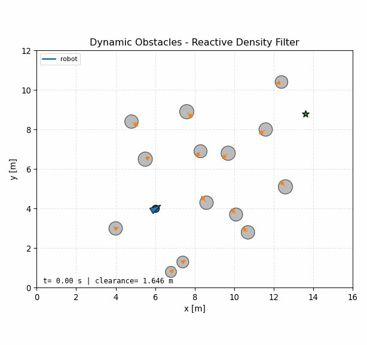
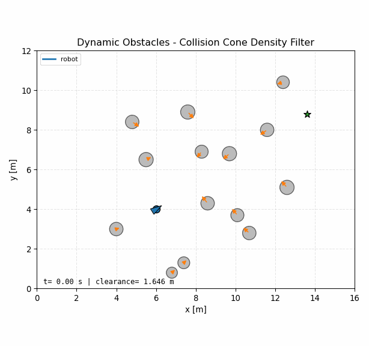
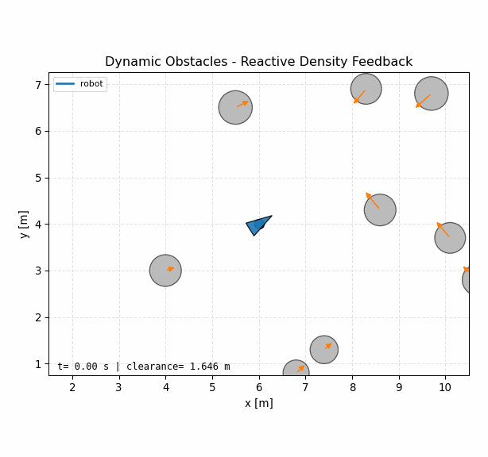
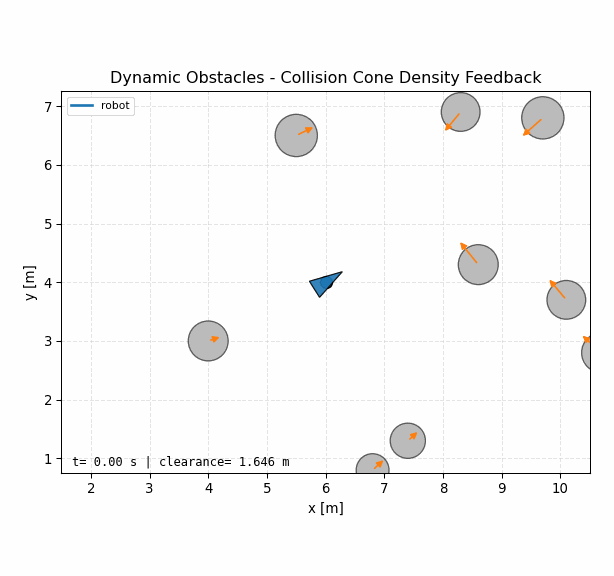
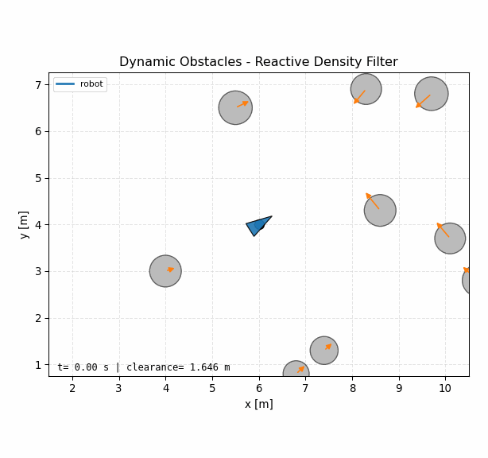

# Dynamic Obstacle Unicycle Examples

This folder studies single-robot unicycle navigation through moving circular
obstacles. The examples keep two dynamic-obstacle configurations:

- `closing_in`: eight `0.37 m` radius obstacles surround the robot and move
  inward while the goal sits farther outside the closing group. A radius sweep
  found `0.37 m` as the largest sampled radius where all six controllers
  succeed; `0.375 m` makes the reactive density filter collide.
- `dense_flow`: a cluttered random-flow style scene with many moving obstacles
  while keeping the final target region unobstructed.

Each controller script is standalone, following the style of the multi-agent
examples. `_config.py` defines the two scenarios, `_plotting.py` defines shared
visualization, and each script contains its own density/controller construction.
The reusable solver pieces still come from `density_utils.controllers`.

## Controllers

Density feedback:

```bash
python3 examples/dynamic_obstacles/density_feedback/reactive.py --scenario closing_in
python3 examples/dynamic_obstacles/density_feedback/collision_cone.py --scenario closing_in
python3 examples/dynamic_obstacles/density_feedback/velocity_obstacle.py --scenario closing_in
```

Density filter:

```bash
python3 examples/dynamic_obstacles/density_filter/reactive.py --scenario dense_flow
python3 examples/dynamic_obstacles/density_filter/collision_cone.py --scenario dense_flow
python3 examples/dynamic_obstacles/density_filter/velocity_obstacle.py --scenario dense_flow
```

To save a GIF:

```bash
python3 examples/dynamic_obstacles/density_filter/velocity_obstacle.py --scenario dense_flow --save-gif --no-plot
```

For a smaller git-friendly video, save MP4 instead:

```bash
python3 examples/dynamic_obstacles/density_filter/velocity_obstacle.py --scenario dense_flow --save-mp4 --no-plot
```

For local-frame dense-flow animations:

```bash
python3 examples/dynamic_obstacles/density_filter/velocity_obstacle.py --scenario dense_flow --save-gif --follow-robot --no-plot
```

Animations are saved under:

```text
examples/dynamic_obstacles/animations/density_feedback/
examples/dynamic_obstacles/animations/density_filter/
```

GIF previews use a compact default stride and `96 dpi`. MP4 export uses x264
with `--mp4-crf 30` by default; increase CRF for smaller files or lower it for
higher visual quality.

## Density Construction

The reactive construction treats each moving obstacle as a circular bump at its
current or one-step predicted position:

```text
Phi_j = beta(||p - p_j||; r_safe, r_sense)
```

Collision-cone density adds a relative-velocity gate:

```text
p_rel = p_j - p
v_rel = v_j - v
h_cc = p_rel^T v_rel + ||p_rel|| ||v_rel|| cos(phi)
```

Velocity-obstacle density scores candidate ego velocities against the velocity
cone boundaries:

```text
v_rel = v - v_j
h_vo = max(cross(left, v_rel), cross(v_rel, right))
```

Density feedback builds a planar command and maps it to unicycle controls.
Density filter solves a one-step constrained problem directly over `[v, omega]`
using the exact unicycle step. The simulation timestep is `--dt`; the filter
prediction timestep defaults to `--dt`, but can be changed with `--filter-dt`.
For the dense-flow reactive filter, the nominal switches to a tapered local
goal controller inside `1.2 m` of the target while the density constraints stay
active. This reduces terminal speed and yaw-rate chatter near the goal.

## Latest Headless Results

These are the latest `--no-plot --print-interval 0` runs used while regenerating
the GIFs.

| Controller | Density | Scenario | Status | Steps | Min clearance [m] | Avg ms |
|---|---|---|---|---:|---:|---:|
| Feedback | reactive | `closing_in` | success | 791 | 0.457 | 0.153 |
| Feedback | collision cone | `closing_in` | success | 130 | 0.177 | 0.108 |
| Feedback | velocity obstacle | `closing_in` | success | 98 | 0.036 | 0.137 |
| Filter | reactive | `closing_in` | success | 187 | 0.054 | 9.317 |
| Filter | collision cone | `closing_in` | success | 151 | 0.208 | 7.647 |
| Filter | velocity obstacle | `closing_in` | success | 159 | 0.086 | 14.545 |
| Feedback | reactive | `dense_flow` | success | 364 | 0.554 | 0.134 |
| Feedback | collision cone | `dense_flow` | success | 259 | 0.198 | 0.115 |
| Feedback | velocity obstacle | `dense_flow` | collision | 91 | -0.002 | 0.300 |
| Filter | reactive | `dense_flow` | success | 458 | 0.216 | 5.265 |
| Filter | collision cone | `dense_flow` | success | 270 | 0.168 | 13.512 |
| Filter | velocity obstacle | `dense_flow` | success | 267 | 0.074 | 18.248 |

## Animation Gallery

Density feedback:

<table>
<tr>
<td align="center"><b>Closing in - reactive</b><br></td>
<td align="center"><b>Closing in - collision cone</b><br></td>
<td align="center"><b>Closing in - velocity obstacle</b><br></td>
</tr>
<tr>
<td align="center"><b>Dense flow - reactive</b><br></td>
<td align="center"><b>Dense flow - collision cone</b><br></td>
<td align="center"><b>Dense flow - velocity obstacle</b><br></td>
</tr>
</table>

Density filter:

<table>
<tr>
<td align="center"><b>Closing in - reactive</b><br></td>
<td align="center"><b>Closing in - collision cone</b><br></td>
<td align="center"><b>Closing in - velocity obstacle</b><br></td>
</tr>
<tr>
<td align="center"><b>Dense flow - reactive</b><br></td>
<td align="center"><b>Dense flow - collision cone</b><br></td>
<td align="center"><b>Dense flow - velocity obstacle</b><br></td>
</tr>
</table>

Dense-flow local-frame views:

<table>
<tr>
<td align="center"><b>Feedback - reactive</b><br></td>
<td align="center"><b>Feedback - collision cone</b><br></td>
<td align="center"><b>Feedback - velocity obstacle</b><br></td>
</tr>
<tr>
<td align="center"><b>Filter - reactive</b><br></td>
<td align="center"><b>Filter - collision cone</b><br></td>
<td align="center"><b>Filter - velocity obstacle</b><br></td>
</tr>
</table>
