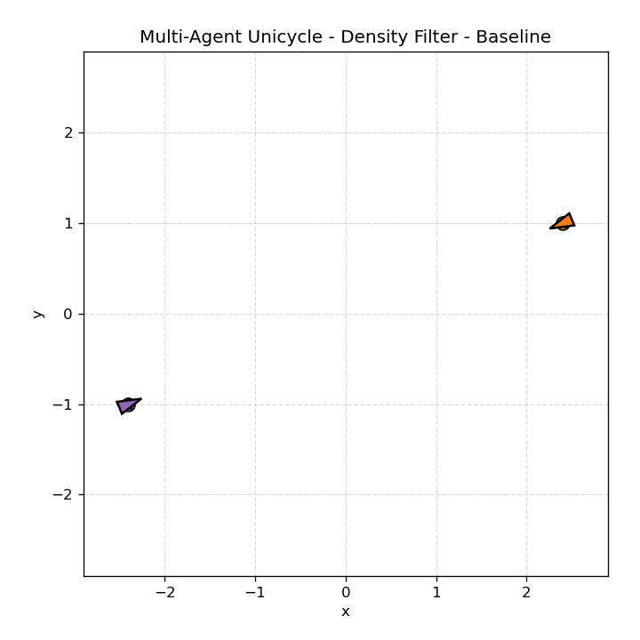
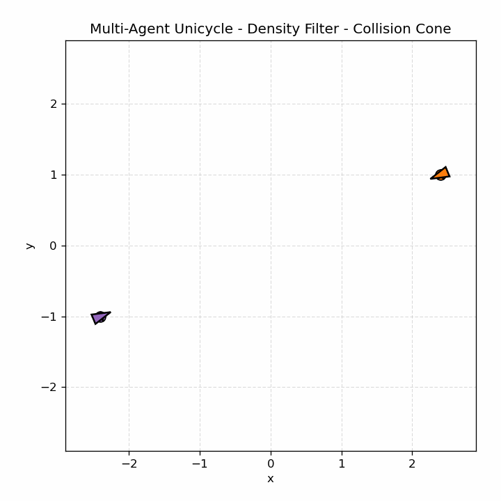
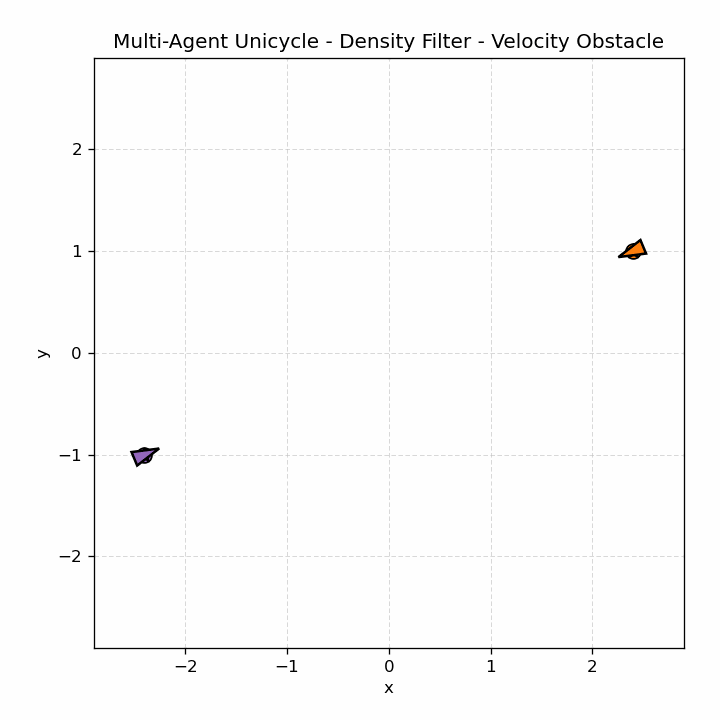
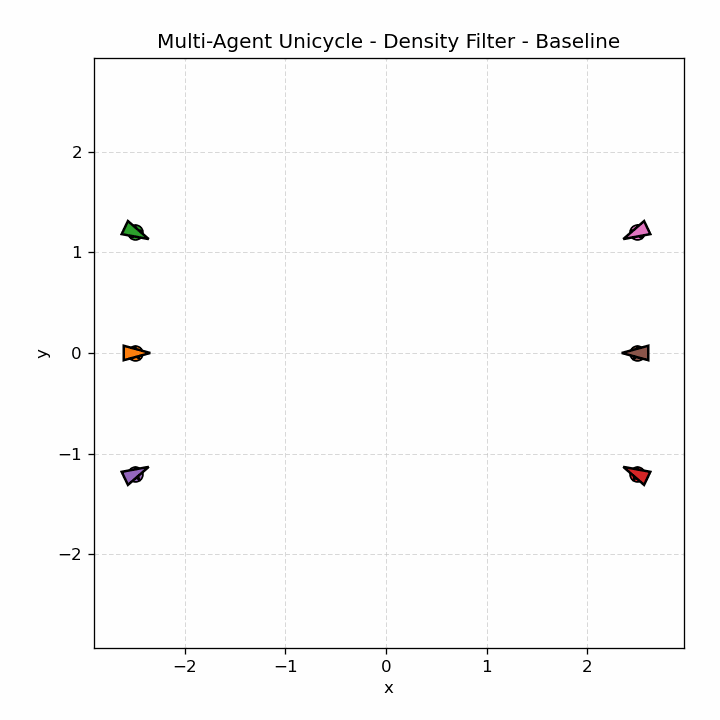
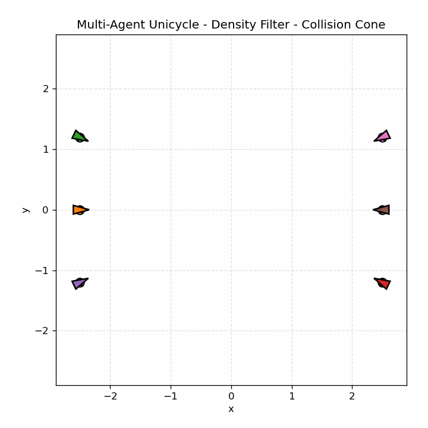
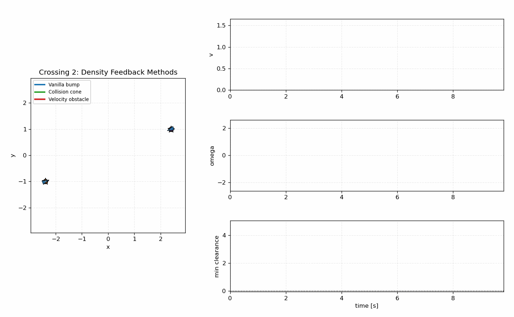
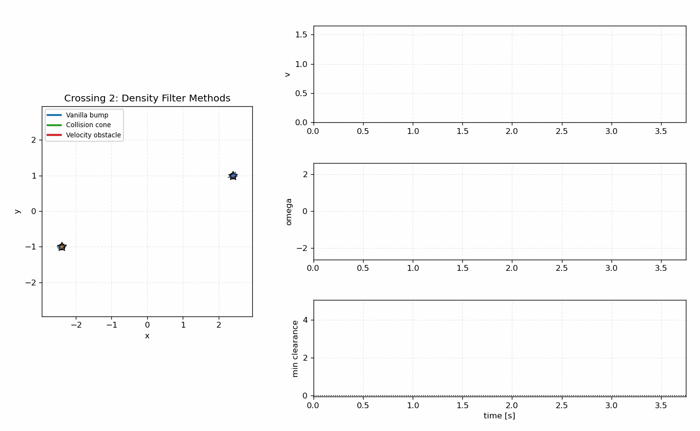
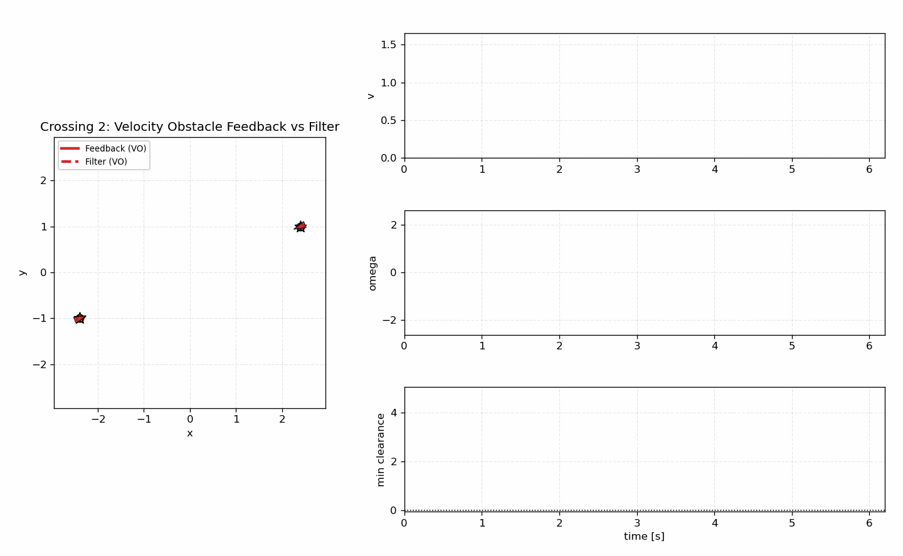
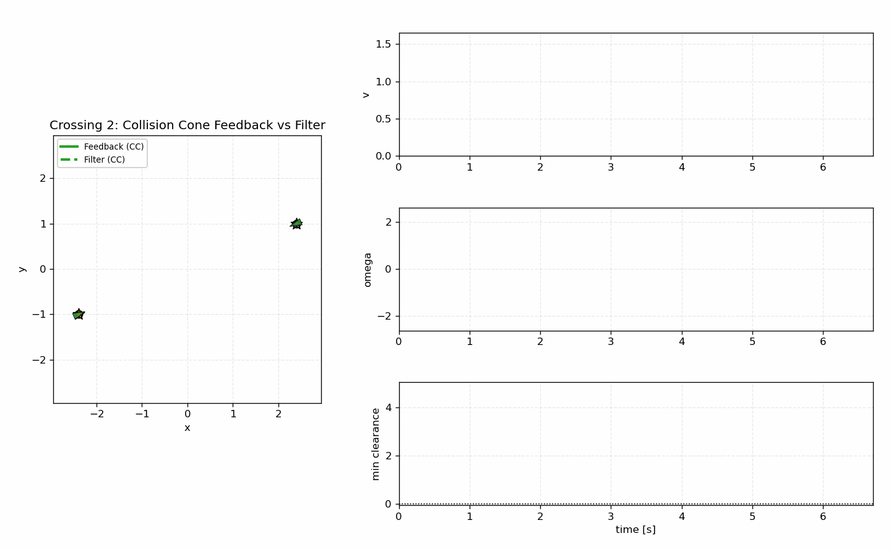

# Multi-Agent Unicycle Density Examples

This folder studies multi-agent unicycle navigation with density functions.
Each agent has a start, goal, heading, forward-speed command, and yaw-rate
command. Other agents are treated as moving safety objects, and the examples
compare three ways to construct the density field:

- vanilla circular bump density,
- collision-cone density,
- velocity-obstacle density.

The examples here focus on two controller families:

- density feedback, which computes a planar single-integrator command and maps
  it to unicycle `[v, omega]` controls;
- density filter, which solves a one-step safety filter directly on the
  unicycle model.

The scripts are intentionally standalone. Shared scenario setup lives in
`density_feedback/_config.py`, and shared plotting lives in `_plotting.py`.

## Density Constructions

All three methods start from the same density-function template. For agent
`i`, let `x_i = [p_i, theta_i]`, goal `x_i^*`, and pairwise obstacle terms
`Phi_ij`. The pose density has the form

```text
rho_i(x_i) = prod_j Phi_ij(p_i, p_j, v_i, v_j) / V_i(x_i)^alpha
```

where

```text
V_i(x_i) = ||p_i - p_i^*||^2 + w_theta * wrap(theta_i - theta_i^*)^2.
```

Large density points toward the goal while the product of bump terms suppresses
density inside unsafe regions. The difference between the three methods is how
`Phi_ij` is constructed.

### 1. Vanilla Bump Density

The baseline treats each neighbor as a circular p-norm bump obstacle:

```text
Phi_ij = beta(||p_i - p_j||; r_safe, r_sense)
```

where `beta = 0` inside the safety radius, smoothly rises through the sensing
annulus, and becomes `1` outside the sensing radius.

This is the most reactive construction. It only knows that another agent is
nearby; it does not know whether the other agent is crossing, approaching, or
moving away.

### 2. Collision-Cone Density

Collision-cone density keeps the same spatial bump, but gates it by a
relative-velocity term. For two disk agents with combined radius `R`, define

```text
p = p_j - p_i
v = v_j - v_i
h_cc = p^T v + ||p|| ||v|| cos(phi)
cos(phi) = sqrt(||p||^2 - R^2) / ||p||
```

When the relative velocity points into the collision cone, `h_cc` becomes
small or negative. We map that margin through a smooth bump:

```text
Phi_ij = beta_space(p_i, p_j) * beta_cc(h_cc)
```

So nearby agents moving away do not trigger the same correction as nearby
agents moving toward a future collision.

This follows the classical collision-cone idea used in dynamic obstacle
avoidance; see Chakravarthy and Ghose, "Obstacle avoidance in a dynamic
environment: A collision cone approach", IEEE SMC, 1998.

### 3. Velocity-Obstacle Density

Velocity obstacles reason directly in ego velocity space. For neighbor `j`, the
velocity obstacle is the set of ego velocities whose relative velocity would
lead to collision. In the scripts, the VO margin is computed from the cone
boundaries:

```text
p = p_j - p_i
axis = p / ||p||
theta = asin(R / ||p||)
left  = rotate(axis, +theta)
right = rotate(axis, -theta)
v_rel = v_i - v_j

h_vo = max(cross(left, v_rel), cross(v_rel, right))
```

Then

```text
Phi_ij = beta_space(p_i, p_j) * beta_vo(h_vo).
```

The controller can react before the agents are physically close, because the
unsafe object is a cone in velocity space rather than only a disk in position
space.

For background, see Fiorini and Shiller, "Motion planning in dynamic
environments using velocity obstacles", IJRR, 1998, and van den Berg et al.,
"Reciprocal Velocity Obstacles for real-time multi-agent navigation", ICRA,
2008.

## Controllers

### Density Feedback

The density-feedback scripts compute a planar command first:

```text
u_planar = f_density(p_i, p_i^*, neighbors)
```

Then the planar vector is converted to unicycle controls:

```text
desired_heading = atan2(u_y, u_x)
heading_error = wrap(desired_heading - theta)
v = ||u_planar|| * max(0, cos(heading_error))
omega = k_heading * heading_error
```

This is fast and visually smooth, but it is an approximate unicycle controller:
the safety reasoning is built in planar single-integrator space and then mapped
onto `[v, omega]`.

The collision-cone feedback script uses the same idea, but applies extra
command conditioning before the unicycle map. The raw collision-cone density
gradient can switch direction quickly in symmetric crossings, so the script
smooths the planar command, removes the desired-heading feedforward term, and
rate-limits both `v` and `omega`. This keeps the velocity-aware correction
visible without turning the unicycle heading into a high-frequency oscillation.

Scripts:

```text
density_feedback/reactive.py
density_feedback/collision_cone.py
density_feedback/velocity_obstacle.py
```

### Density Filter

The density-filter scripts use the exact unicycle step in the safety solve.
Each timestep builds a method-specific nominal `u_nom`, then solves a one-step
filter over `[v, omega]`:

```text
minimize    ||u - u_nom||_R^2 + slack penalties
subject to  rho(x_next) - rho(x) - dt * slack * rho(x) >= 0
            x_next = unicycle_step(x, u, dt)
```

The baseline nominal is the same density-blend command used in the unicycle
examples, mapped into unicycle controls. The collision-cone and VO filters use
matching velocity-aware nominals before the filter. These scripts also use a
synchronous velocity snapshot: every agent solves from the same frozen neighbor
velocity estimate for that timestep, then all updated velocities are published
together.

Scripts:

```text
density_filter/reactive.py
density_filter/collision_cone.py
density_filter/velocity_obstacle.py
```

## Scenarios

Available scenarios:

| Scenario | Description |
|---|---|
| `crossing2` | two agents swap across a diagonal crossing |
| `crossing4` | four agents cross through one central interaction region |
| `crossing6` | six agents cross with dense pairwise interactions |
| `swap8` | eight agents on a ring swap nearby offset goals |
| `swap8_opposite` | eight agents swap with diagonally opposite goals |
| `swap10` | ten-agent ring swap |
| `swap12` | twelve-agent wider ring swap |

The density-filter GIF set currently uses `crossing2`, `crossing4`,
`crossing6`, and `swap8_opposite`. The density-feedback GIF set covers all
seven scenarios.

## Run Commands

Run from the repository root.

Density feedback:

```bash
python3 examples/multi_agent/density_feedback/reactive.py --scenario crossing6
python3 examples/multi_agent/density_feedback/collision_cone.py --scenario crossing6
python3 examples/multi_agent/density_feedback/velocity_obstacle.py --scenario crossing6
```

Density filter:

```bash
python3 examples/multi_agent/density_filter/reactive.py --scenario crossing6
python3 examples/multi_agent/density_filter/collision_cone.py --scenario crossing6
python3 examples/multi_agent/density_filter/velocity_obstacle.py --scenario crossing6
```

Headless timing runs:

```bash
python3 examples/multi_agent/density_feedback/velocity_obstacle.py --scenario crossing6 --no-plot --print-interval 0
python3 examples/multi_agent/density_filter/velocity_obstacle.py --scenario crossing6 --no-plot --print-interval 0
```

Save GIFs:

```bash
python3 examples/multi_agent/density_feedback/velocity_obstacle.py --scenario crossing6 --save-gif --no-plot
python3 examples/multi_agent/density_filter/velocity_obstacle.py --scenario crossing6 --save-gif --no-plot
```

Crossing2 comparison dashboards:

```bash
python3 examples/multi_agent/compare_crossing2_feedback_filter.py
```

The comparison dashboards replay the crossing2 runs sequentially. Completed
method tracks remain visible, while the active method shows the moving
triangles. The live plots show each agent's `v`, each agent's `omega`, and the
minimum pairwise clearance versus `time [s]`. In the feedback-vs-filter
dashboards, feedback is drawn with a solid line and the filter with a dashed
line; both entries use the same density-construction color.

Animations are saved under:

```text
examples/multi_agent/animations/density_feedback/
examples/multi_agent/animations/density_filter/
examples/multi_agent/animations/comparison/
```

## Average Solve Times

The table reports `avg_iteration_mean` printed by each script on this machine.
For feedback, this is the mean controller computation time per agent per
simulation step. For filters, this is the mean one-step QP/filter time per
agent per simulation step.

| Controller | Density construction | `crossing2` avg ms | `crossing6` avg ms |
|---|---|---:|---:|
| Density feedback | vanilla bump | 0.081 | 0.204 |
| Density feedback | collision cone | 0.156 | 0.467 |
| Density feedback | velocity obstacle | 0.183 | 0.500 |
| Density filter | vanilla bump | 0.603 | 3.450 |
| Density filter | collision cone | 0.984 | 3.838 |
| Density filter | velocity obstacle | 0.950 | 4.805 |

The filter is more expensive because it solves a constrained unicycle problem
at every timestep. The velocity-aware variants are slightly more expensive than
the vanilla bump because they evaluate relative-velocity margins and active
neighbor risk scores.

## Animation Gallery

Density feedback examples:

<table>
<tr>
<td align="center"><b>Crossing 6 - Vanilla bump</b><br></td>
<td align="center"><b>Crossing 6 - Collision cone</b><br></td>
<td align="center"><b>Crossing 6 - Velocity obstacle</b><br></td>
</tr>
</table>

Density filter examples:

<table>
<tr>
<td align="center"><b>Crossing 2 - Vanilla bump filter</b><br></td>
<td align="center"><b>Crossing 2 - Collision cone filter</b><br></td>
<td align="center"><b>Crossing 2 - VO filter</b><br></td>
</tr>
<tr>
<td align="center"><b>Crossing 6 - Vanilla bump filter</b><br></td>
<td align="center"><b>Crossing 6 - Collision cone filter</b><br></td>
<td align="center"><b>Crossing 6 - VO filter</b><br></td>
</tr>
</table>

Crossing2 dashboard comparisons:

<table>
<tr>
<td align="center"><b>Feedback methods</b><br></td>
<td align="center"><b>Filter methods</b><br></td>
</tr>
<tr>
<td align="center"><b>VO feedback vs filter</b><br></td>
<td align="center"><b>Collision cone feedback vs filter</b><br></td>
</tr>
</table>

## Notes

- The vanilla bump construction is intentionally kept as the baseline. It is
  simple and reactive, but it cannot distinguish an agent moving away from one
  moving into a collision course.
- Collision-cone and velocity-obstacle density terms add relative-velocity
  information to the same density-function framework.
- Density feedback is fastest and smoothest. Density filtering is more faithful
  to the unicycle dynamics because the optimization variable is directly
  `[v, omega]`.
- The smoothed collision-cone feedback crossing2 run reaches the goal with
  `min_pair_clearance = 0.550`, so the controller remains conservative while
  avoiding the earlier speed/yaw-rate chatter.
