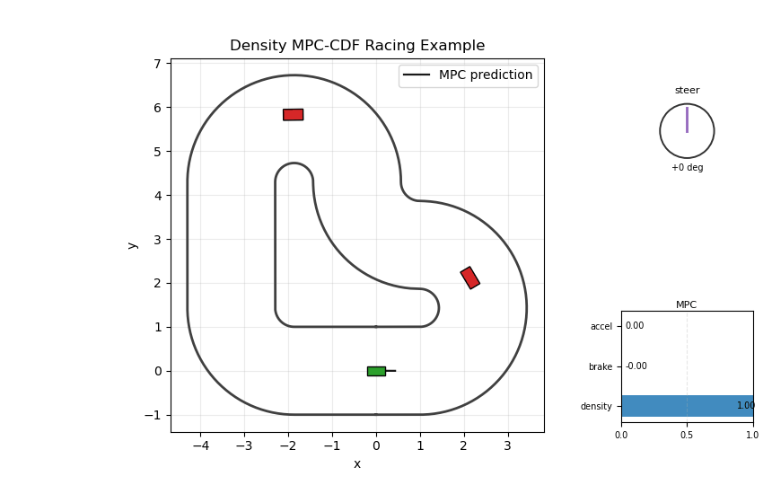
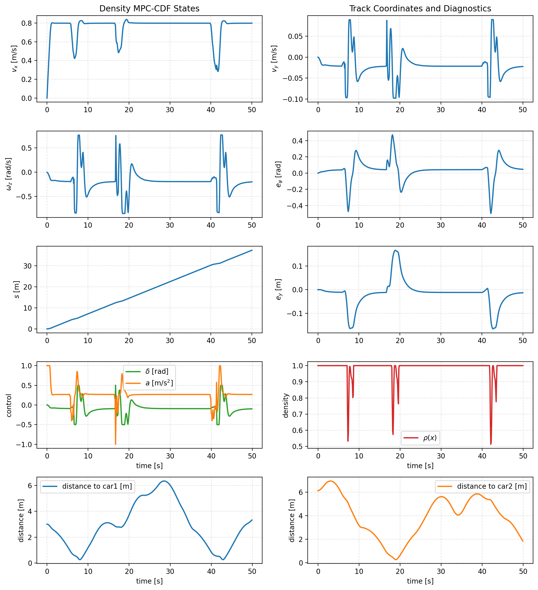
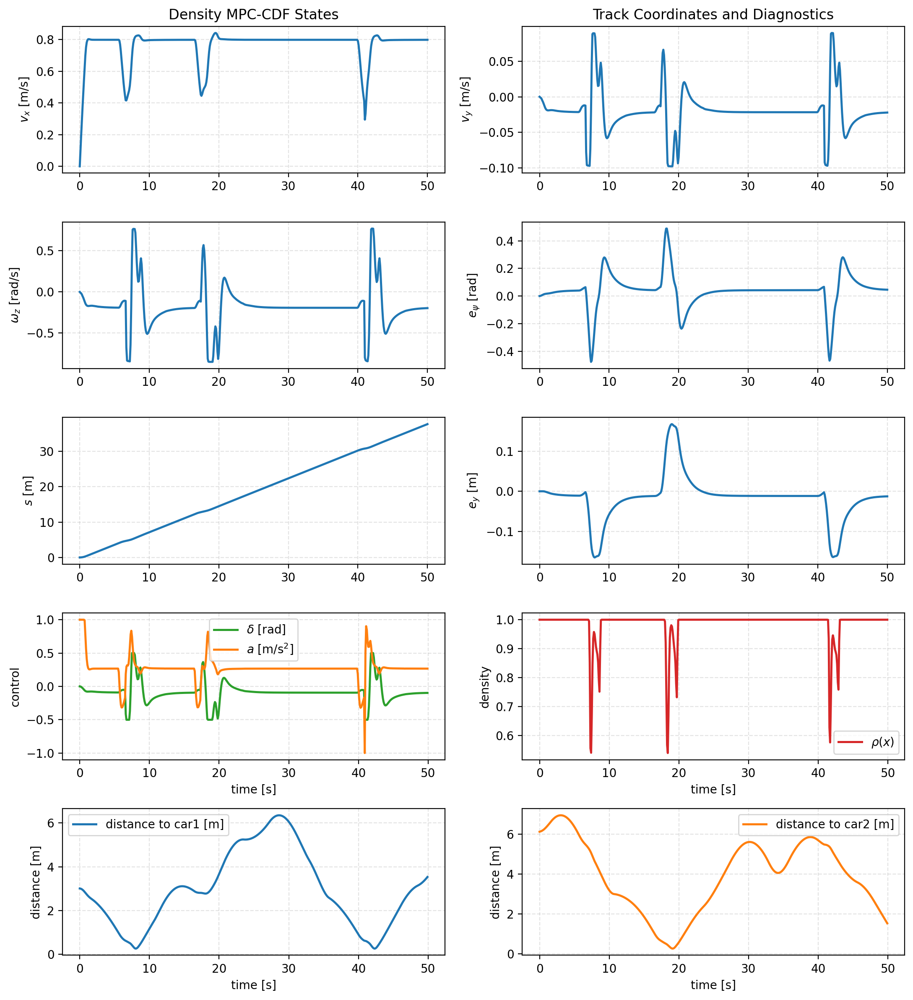

# Racing Density MPC-CDF Example

This example studies density-constrained model predictive control for a racing
vehicle on a closed track with moving obstacle cars. The ego vehicle tracks a desired speed on an L-shaped track while avoiding two
scripted moving cars using a MPC-CDF safety condition (discrete time control density function constraint in a discrete MPC setting). The track layout is inspired by: https://github.com/HybridRobotics/car-racing

## Problem Formulation

The ego vehicle state is represented in curvilinear track coordinates as

$$
x =
\begin{bmatrix}
v_x & v_y & \omega_z & e_\psi & s & e_y
\end{bmatrix}^\top,
$$

where \(v_x\) and \(v_y\) are body-frame velocities, \(\omega_z\) is yaw rate,
\(e_\psi\) is heading error relative to the track tangent, \(s\) is progress
along the track, and \(e_y\) is lateral deviation from the centerline.

The control input is

$$
u =
\begin{bmatrix}
\delta & a
\end{bmatrix}^\top,
$$

where \(\delta\) is steering and \(a\) is longitudinal acceleration.

The control objective is to track a target speed and remain near the centerline,

$$
v_x \rightarrow v_{\mathrm{ref}}, \qquad e_y \rightarrow 0,
$$

while avoiding moving obstacle cars and staying inside the track.

## Prediction Dynamics

The MPC prediction model uses the
discrete-time LTI dynamics:

$$
x_{k+1} = A x_k + B u_k.
$$

The matrices \(A\) and \(B\) are copied into `config.py` from the reference
car-racing LTI model.
The script  keeps the nonlinear dynamic bicycle model available in the
code path, but the default setting is:

```python
USE_LTI_MODEL = True
```

## Moving Obstacles

Each obstacle car follows a scripted trajectory in curvilinear coordinates:

$$
s_i(t) = s_{i,0} + v_i t, \qquad e_{y,i}(t) = \bar e_{y,i}.
$$

In the default setup,

$$
s_1(t) = 4.0 + 0.2t, \qquad e_{y,1} = 0.1,
$$

and

$$
s_2(t) = 10.0 + 0.2t, \qquad e_{y,2} = -0.1.
$$

## Density Function

The obstacle geometry is based on the superellipse.  For an ego state \(x\) and obstacle \(i\), define

$$
\Delta s_i = s - s_i,
\qquad
\Delta e_{y,i} = e_y - e_{y,i}.
$$

The signed longitudinal difference \(\Delta s_i\) is wrapped around the closed
track so that nearby cars are treated correctly across the start/finish line.

The obstacle superellipse value is

$$
z_i(x) =
\left(\frac{|\Delta s_i|}{L_i}\right)^d
+
\left(\frac{|\Delta e_{y,i}|}{W_i}\right)^d,
$$

where \(d=6\), and

$$
L_i = \frac{\ell_{\mathrm{ego}}+\ell_i}{2},
\qquad
W_i = \frac{w_{\mathrm{ego}}+w_i}{2}.
$$

The unsafe obstacle region is described by

$$
z_i(x) < 1 + m,
$$

where \(m\) is the configured obstacle safety margin.

We support two smooth obstacle-density mappings.  The default option is a
sigmoid density of the normalized superellipse value:

$$
\rho_i^{\mathrm{sig}}(x) =
\frac{1}
{1+\exp\left(
-\kappa
\frac{z_i(x)-(1+m)}{\Delta}
\right)}.
$$

Here \(\Delta\) is the obstacle transition width and \(\kappa\) controls how
sharply the density changes near the safety boundary.

The second option is the compact bump formulation:

$$
\rho_i^{\mathrm{bump}}(x) =
\mathrm{bump}
\bigl(
z_i(x);\,
1+m,\,
1+m+\Delta
\bigr).
$$

Both choices satisfy the same qualitative behavior:

$$
\rho_i(x) \approx 0 \quad \text{near the obstacle},
\qquad
\rho_i(x) \approx 1 \quad \text{far from the obstacle}.
$$

The track density is defined in the same way from the lateral track clearance:

$$
c_{\mathrm{track}}(x) = w_{\mathrm{track}} - \lvert e_y \rvert.
$$

Using track margin \(m_{\mathrm{track}}\) and transition width
\(\Delta_{\mathrm{track}}\), the track density is

$$
\rho_{\mathrm{track}}(x) =
\mathrm{bump}
\bigl(
c_{\mathrm{track}}(x);\,
m_{\mathrm{track}},\,
m_{\mathrm{track}}+\Delta_{\mathrm{track}}
\bigr).
$$

Finally, the total safety density used by the MPC is the product of the track
density and all obstacle density terms:

$$
\rho(x) = \rho_{\mathrm{track}}(x)\prod_i \rho_i(x).
$$

In the implementation, this product is used to encourage early, smooth
avoidance.  Unlike a compact-support bump that becomes exactly flat inside the
unsafe set, this sigmoid density remains smooth and non-flat, so the optimizer
still sees a useful direction when it approaches an obstacle.

The density mode is selected in `config.py`:

```python
OBSTACLE_DENSITY_MODE = "sigmoid"  # "sigmoid" or "bump"
```

or from the command line:

```bash
python examples/racing/density_mpc/density_mpc.py --density-mode bump
```

## MPC-CDF Constraint

At each time step, the controller solves an MPC problem over horizon \(N\):

$$
\min_{u_0,\dots,u_{N-1}}
\sum_{k=0}^{N-1}
\ell(x_k,u_k)
$$

subject to the prediction dynamics

$$
x_{k+1} = A x_k + B u_k,
$$

input bounds

$$
-\delta_{\max} \leq \delta_k \leq \delta_{\max},
\qquad
-a_{\max} \leq a_k \leq a_{\max},
$$

speed bounds

$$
v_{\min} \leq v_{x,k} \leq v_{\max},
$$

and the MPC-CDF density transport constraint.  The reference MPC-CDF code uses

$$
(\rho_{k+1}-\rho_k) + dt\,\mathrm{div}(F_d)(x_k)\rho_k - dt\,C_k\rho_k \geq 0,
$$

where \(C_k \geq 0\) is a slack variable.  In this racing example, the
prediction model is the LTI map

$$
x_{k+1}=Ax_k+Bu_k,
$$

so the discrete-map divergence is constant:

$$
\mathrm{div}(F_d)=\mathrm{tr}(A).
$$

The implemented transport constraint is therefore

$$
(\rho(x_{k+1})-\rho(x_k)) + dt\,\mathrm{tr}(A)\rho(x_k) - dt\,C_k\rho(x_k)
\geq 0.
$$

We also keep a density floor

$$
\rho(x_{k+1}) \geq \rho_{\min}
$$

to avoid very low-density near-collision behavior.  The slack variables satisfy
\(C_k \geq 0\) and are heavily penalized in the objective, mirroring the
reference MPC-CDF implementation.

An optional hard superellipse safety condition can also be enabled:

$$
z_i(x_{k+1}) \geq 1 + m
\qquad \text{for each obstacle } i.
$$

This is disabled by default so that safety is encoded directly through the
density-CDF constraints.  It is useful as a diagnostic guard, but the default
experiment uses the density formulation alone.

## Running The Example

Run the example with:

```bash
MPLCONFIGDIR=/tmp/matplotlib python examples/racing/density_mpc/density_mpc.py
```

By default, the script shows the animation and saves a GIF to:

```text
animations/density_mpc.gif
```

For a headless run:

```bash
MPLCONFIGDIR=/tmp/matplotlib python examples/racing/density_mpc/density_mpc.py --no-animation
```

For quick debugging without saving:

```bash
MPLCONFIGDIR=/tmp/matplotlib python examples/racing/density_mpc/density_mpc.py \
  --steps 40 \
  --no-animation \
  --no-save-animation
```

## Result

The density-MPC controller tracks the L-shaped racing track while avoiding two
moving cars.  The density term causes early response and keeps the ego vehicle
outside the obstacle superellipse without requiring the optional hard geometric
constraint.  We tested both obstacle-density choices:

| Density mode | Observed behavior |
| --- | --- |
| `bump` | Gives the cleanest avoidance behavior in the current setup. The ego vehicle commits earlier to the passing maneuver and avoids both moving cars without entering the obstacle safety region. |
| `sigmoid` | Produces smoother density gradients, but is more sensitive to tuning. With a soft transition, the ego vehicle can prefer trailing behind the second car because that is cheaper than paying lateral tracking and steering-rate cost. Shifting the sigmoid midpoint into the transition band makes it more conservative and closer to the bump result. |

### Bump Density

The bump density gives the cleanest behavior in this example.  The ego vehicle
responds early enough to pass both cars while remaining inside the track.



The corresponding state, control, density, and obstacle-distance histories are:



### Sigmoid Density

The sigmoid density gives a smoother transition field.  In the current tuned
setup, it remains safe, but the maneuver is more conservative and can trail
behind the second car longer than the bump formulation.


The corresponding state, control, density, and obstacle-distance histories are:



### Bump Versus Sigmoid

The full state and control plots look similar because most of the lap is spent
tracking the same reference trajectory.  The important difference appears in a
short window near the second moving car, around simulation steps 180--186.

In that window, the bump density stays close to one, so the MPC only needs a
mild steering correction.  The sigmoid density drops more gradually before
recovering, so the optimizer reacts later and then uses a much larger steering
command:

| Step | bump density | sigmoid density | bump \(e_y\) | sigmoid \(e_y\) | bump steering | sigmoid steering |
| --- | ---: | ---: | ---: | ---: | ---: | ---: |
| 180 | 0.997 | 0.978 | 0.031 | 0.084 | -1.5 deg | -0.2 deg |
| 181 | 0.997 | 0.847 | 0.031 | 0.103 | -1.5 deg | -11.5 deg |
| 182 | 0.997 | 0.648 | 0.031 | 0.119 | -1.5 deg | -22.9 deg |
| 183 | 0.997 | 0.532 | 0.031 | 0.132 | -1.5 deg | -28.6 deg |
| 184 | 0.997 | 0.577 | 0.031 | 0.142 | -1.5 deg | -28.6 deg |
| 185 | 0.997 | 0.744 | 0.031 | 0.150 | -1.5 deg | -28.6 deg |
| 186 | 0.997 | 0.890 | 0.031 | 0.156 | -1.5 deg | -28.6 deg |

The largest observed differences over the run were:

| Quantity | Maximum difference |
| --- | ---: |
| global position | 6.00 m |
| lateral error \(e_y\) | 0.196 m |
| speed \(v_x\) | 0.636 m/s |
| steering \(\delta\) | 32.35 deg |
| acceleration \(a\) | 0.813 m/s\(^2\) |
| density \(\rho\) | 0.465 |

Thus, the main visible distinction is not a large change throughout the whole
trajectory.  It is the local interaction near the second car: the bump
formulation creates a sharper safe/unsafe transition and encourages an earlier,
cleaner avoidance maneuver, while the sigmoid formulation is smoother but can
delay the response unless it is tuned more conservatively.

### Reproducing The Results

To regenerate the bump result:

```bash
MPLCONFIGDIR=/tmp/matplotlib python examples/racing/density_mpc/density_mpc.py \
  --density-mode bump \
  --save-animation animations/density_mpc_Ltrack_bump.gif \
  --save-diagnostics animations/density_mpc_state_controls_Ltrack_bump.png
```

To run the sigmoid version:

```bash
MPLCONFIGDIR=/tmp/matplotlib python examples/racing/density_mpc/density_mpc.py \
  --density-mode sigmoid \
  --save-animation animations/density_mpc_Ltrack_sigmoid.gif \
  --save-diagnostics animations/density_mpc_state_controls_Ltrack_sigmoid.png
```

## TODO

- Add an explicit inflation radius or geometry buffer for the other cars.
- Add more track layouts beyond the current L-shaped track.
- Add quantitative comparisons against baseline MPC, MPC-CBF, and different
  density formulations.
