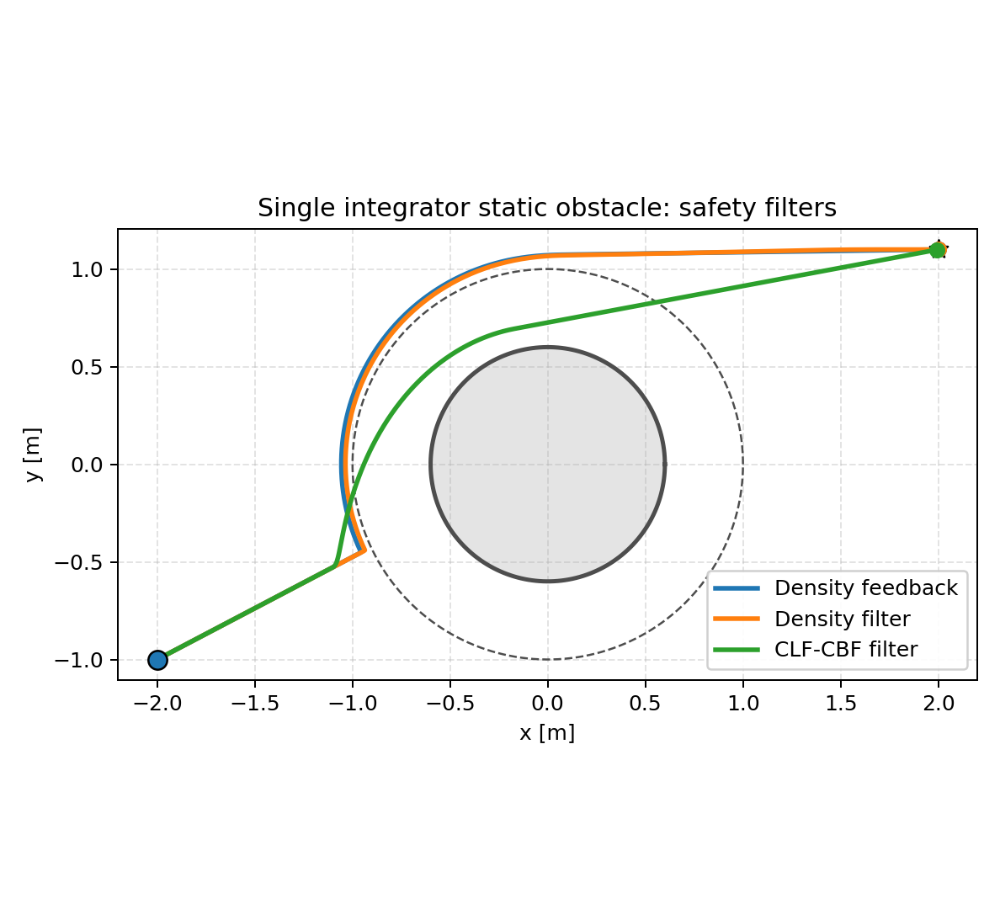
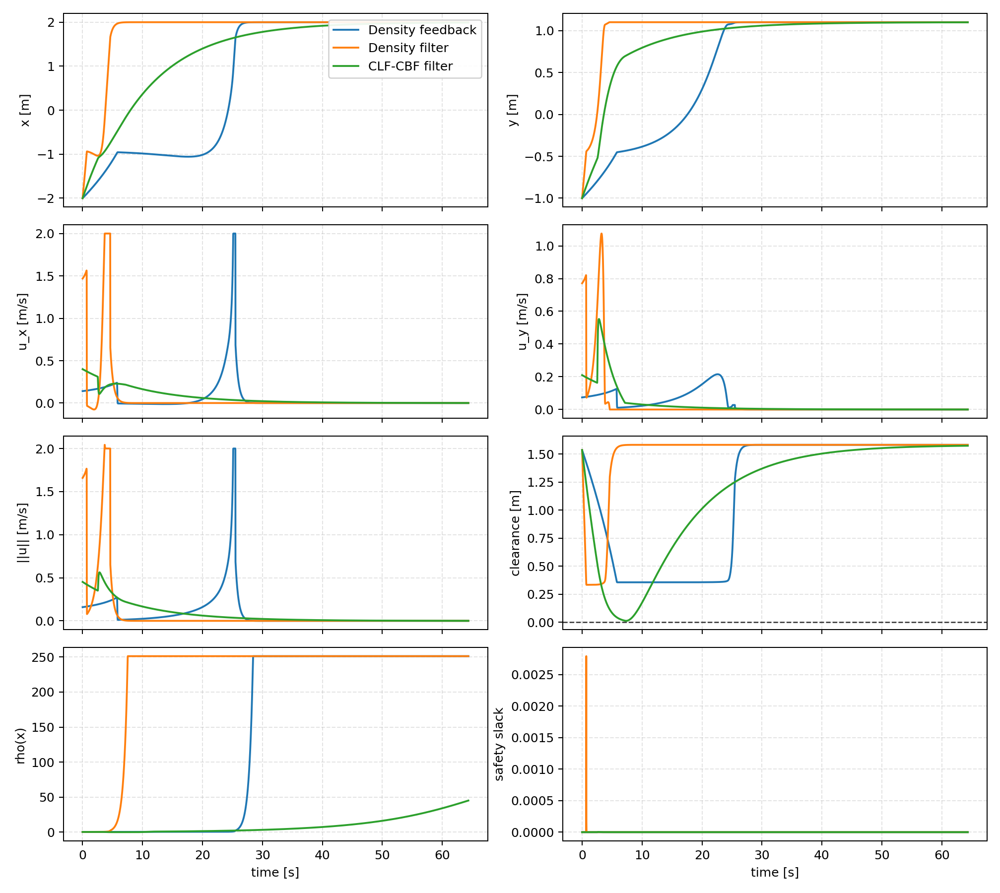
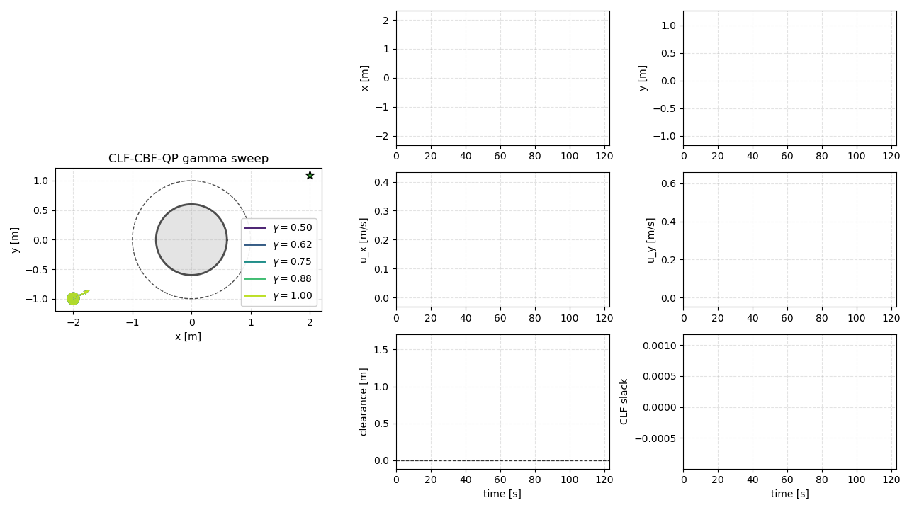
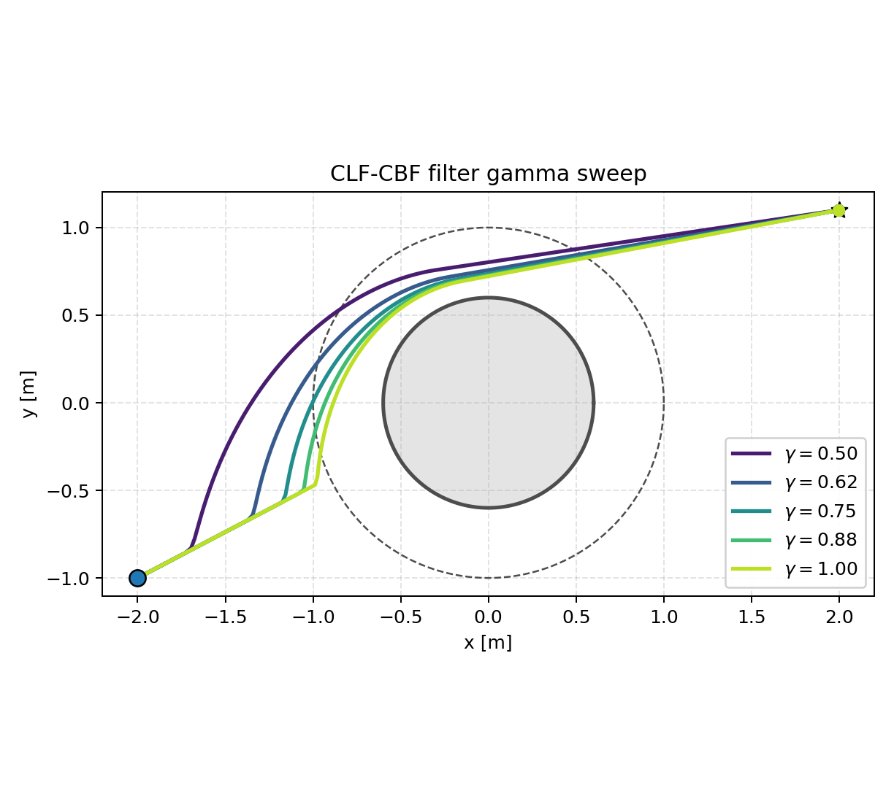
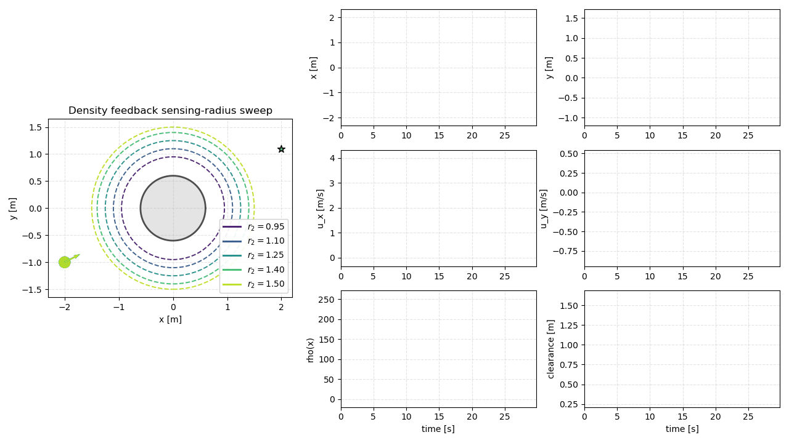
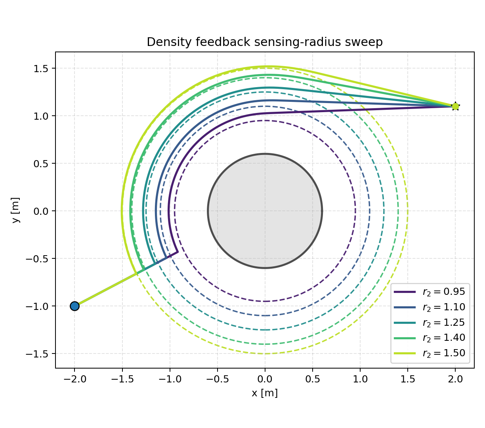
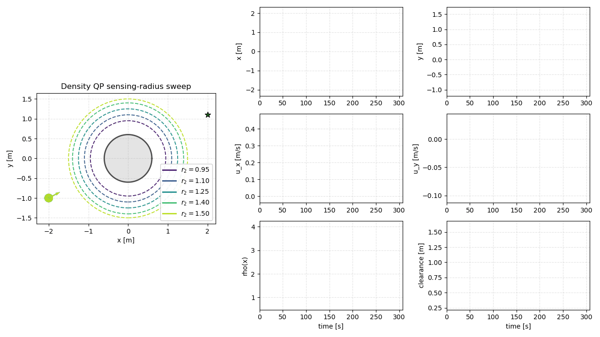
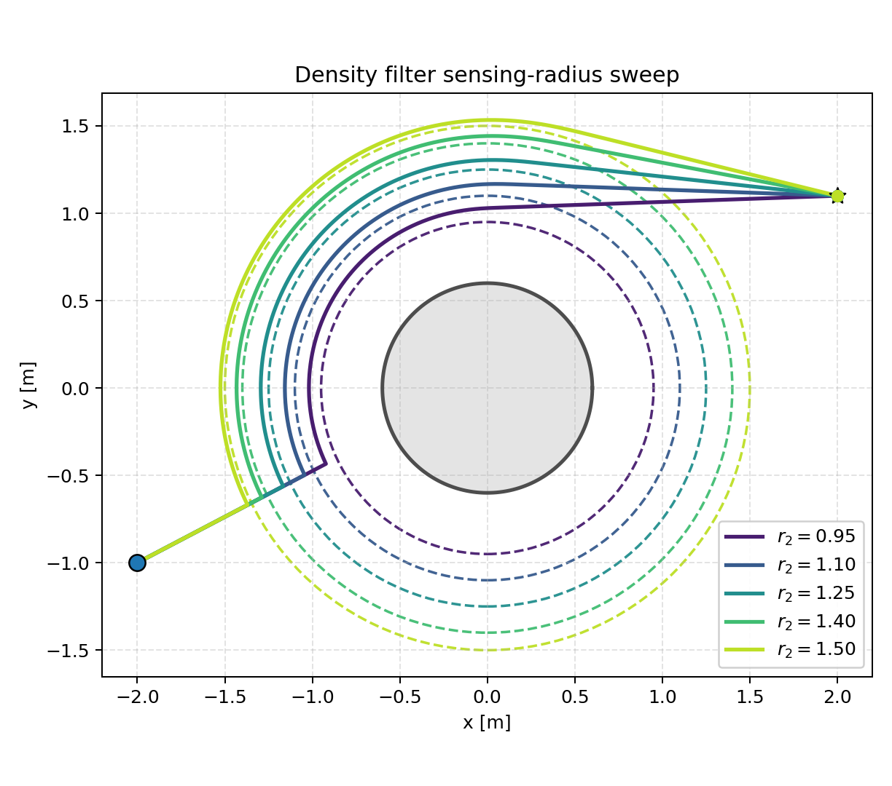

# Single-Integrator Safety Filters

These examples study density-based navigation for a planar single-integrator
agent moving from a start point to a goal while avoiding p-norm obstacles. The
main static single-obstacle examples compare:

- `density_feedback.py`: direct nonlinear density-gradient feedback.
- `density_filter.py`: a discrete density safety filter around a nominal command.
- `cbf_filter.py`: a CLF-CBF safety filter.

The `density_mpc.py` files in the multi-obstacle and local-sensing folders are
older placeholders/experiments and are not part of the filter comparison below.

## Setup

From the repository root:

```bash
python -m pip install -e .
python -m pip install pillow
```

Most scripts can be run from the repository root:

```bash
python examples/single_integrator/static_single_obstacle/compare_safety_filters.py --no-plot
```

Use `--no-plot` or `--no-show` for headless runs. Use `--save-gif` on the older
single-controller scripts when you want their basic animation path.

## Dynamics

The single-integrator state is the planar position

$$
x =
\begin{bmatrix}
p_x & p_y
\end{bmatrix}^\top,
$$

with control

$$
u =
\begin{bmatrix}
u_x & u_y
\end{bmatrix}^\top.
$$

The continuous-time model is

$$
\dot{x}=u,
$$

and the examples use forward Euler integration:

$$
x_{k+1}=x_k+\Delta t\,u_k.
$$

## Obstacles

Obstacles are p-norm balls with an inner safety radius \(r_1\) and an outer
sensing/density radius \(r_2\). For obstacle \(i\), define

$$
d_i(x)=
\left\|
S_i^{-1}R(-\theta_i)(x-c_i)
\right\|_{p_i},
$$

where \(c_i\) is the obstacle center, \(R(-\theta_i)\) rotates into the obstacle
frame, and \(S_i\) is an optional diagonal scaling matrix. The agent radius is
handled by inflating \(r_1\) and \(r_2\) before computing controls.

The smooth obstacle bump is

$$
b_i(x)=
\begin{cases}
0, & d_i(x)\le r_{1,i},\\[4pt]
1, & d_i(x)\ge r_{2,i},\\[4pt]
\dfrac{\exp(-1/m_i)}
{\exp(-1/m_i)+\exp(-1/(1-m_i))},
& r_{1,i}<d_i(x)<r_{2,i},
\end{cases}
$$

with

$$
m_i(x)=
\frac{d_i(x)^{p_i}-r_{1,i}^{p_i}}
{r_{2,i}^{p_i}-r_{1,i}^{p_i}}.
$$

## Density Function

The density field is

$$
\rho(x)=
\frac{\Phi(x)}
{\lVert x-x_g\rVert^{2\alpha}},
\qquad
\Phi(x)=\prod_i b_i(x),
$$

where \(x_g\) is the goal. The goal term grows near the target, while
\(\Phi(x)\) suppresses density inside obstacles and transitions smoothly in the
sensing band.

## Density Feedback

The density feedback controller follows the density gradient:

$$
u_{\rho}(x)=k_{\rho}\nabla\rho(x).
$$

Near the goal, the script switches to a local discrete LQR stabilizer:

$$
u_{\mathrm{lqr}}(x)=-K(x-x_g).
$$

The final command is saturated componentwise before integration. This controller
is a nonlinear feedback law, not an optimization problem.

Run the static single-obstacle feedback example:

```bash
python examples/single_integrator/static_single_obstacle/density_feedback.py --save-gif
```

## Density Filter

The density filter first computes a nominal command \(u_{\mathrm{nom}}\), then
solves a one-step constrained nonlinear safety filter.

Objective:

$$
\min_{u,s}
\frac{1}{2}\lVert u-u_{\mathrm{nom}}\rVert_W^2
+
\frac{1}{2}w_s\lVert s\rVert^2
$$

Subject to:

$$
\rho(x_{k+1})-\rho(x_k)
+
\Delta t\,\mathrm{div}(F_d)(x_k)\rho(x_k)
+
s
\ge
0
$$

$$
x_{k+1}=x_k+\Delta t\,u
$$

$$
u_{\min}\le u\le u_{\max},
\qquad
s\ge 0
$$

In these examples, \(\mathrm{div}(F_d)=0\). Because the constraint evaluates
\(\rho(x_k+\Delta t\,u)\), this is generally a nonlinear filter rather than a
convex quadratic program.

Run the static single-obstacle density filter:

```bash
python examples/single_integrator/static_single_obstacle/density_filter.py --no-plot
```

## CLF-CBF Filter

The CLF-CBF filter uses a circular barrier around the inflated obstacle:

$$
h(x)=\lVert x-c\rVert^2-r_1^2.
$$

The continuous-time CBF condition used in the per-step filter is affine in
\(u\):

$$
\nabla h(x)^\top u+\gamma h(x)+s_{\mathrm{cbf}}\ge 0.
$$

The goal-reaching CLF is

$$
V(x)=\lVert x-x_g\rVert^2,
$$

with relaxed decrease condition

$$
\nabla V(x)^\top u
\le
-c_{\mathrm{clf}}V(x)+s_{\mathrm{clf}}.
$$

The implemented filter solves the following problem.

Objective:

$$
\min_{u,s_{\mathrm{cbf}},s_{\mathrm{clf}}}
\frac{1}{2}\lVert u\rVert^2
+
\frac{1}{2}w_{\mathrm{cbf}}s_{\mathrm{cbf}}^2
+
\frac{1}{2}w_{\mathrm{clf}}s_{\mathrm{clf}}^2
$$

Subject to:

$$
\nabla h(x)^\top u+\gamma h(x)+s_{\mathrm{cbf}}\ge 0
$$

$$
\nabla V(x)^\top u+c_{\mathrm{clf}}V(x)-s_{\mathrm{clf}}\le 0
$$

$$
u_{\min}\le u\le u_{\max}
$$

$$
s_{\mathrm{cbf}}\ge 0,
\qquad
s_{\mathrm{clf}}\ge 0
$$

For the current circular obstacle barrier this per-step problem is convex, but
the resulting closed-loop controller is nonlinear because the constraints change
with \(x\).

Run the CLF-CBF filter:

```bash
python examples/single_integrator/static_single_obstacle/cbf_filter.py --save-gif
```


## Static Safety-Filter Comparison

The main comparison runs density feedback, density filter, and CLF-CBF filter on
the same static single-obstacle setup:

```bash
python examples/single_integrator/static_single_obstacle/compare_safety_filters.py --no-plot
```


Static summaries:





## CLF-CBF Gamma Sweep

This script runs five CLF-CBF filter agents with different \(\gamma\) values:

```bash
python examples/single_integrator/static_single_obstacle/clf_cbf_filter_gamma_sweep.py --no-show
```

Default values:

```text
gamma = 0.50, 0.625, 0.75, 0.875, 1.00
```





## Sensing-Radius Sweeps

The sensing-radius sweeps vary the outer obstacle radius \(r_2\) while keeping
the physical/safety radius fixed. The default values are:

```text
r2 = 0.95, 1.10, 1.25, 1.40, 1.50
```

Density feedback sweep:

```bash
python examples/single_integrator/static_single_obstacle/density_feedback_sensing_radius_sweep.py --no-show
```





Density filter sweep:

```bash
python examples/single_integrator/static_single_obstacle/density_filter_sensing_radius_sweep.py --no-show
```





## Other Scenarios

The same controller split exists in:

- `static_multi_obstacles/`
- `local_sensing/`

For example:

```bash
python examples/single_integrator/static_multi_obstacles/density_feedback.py --save-gif
python examples/single_integrator/static_multi_obstacles/density_filter.py --save-gif
python examples/single_integrator/local_sensing/density_feedback.py --save-gif
python examples/single_integrator/local_sensing/density_filter.py --save-gif
```

## Common Options

```bash
--save-gif       save a GIF animation in scripts that use the shared plotter
--no-plot        run without opening plots
--no-show        save sweep outputs without opening matplotlib windows
--no-gif         skip GIF generation in comparison/sweep scripts
--steps N        override max simulation steps
```
