# Unicycle Safety Filters

These examples study density-based and CBF-based navigation for a planar
kinematic unicycle moving from a start pose to a goal while avoiding p-norm
obstacles. The static single-obstacle setup now includes:

- `density_feedback.py`: direct density-gradient feedback converted to unicycle commands.
- `density_filter.py`: a one-step discrete density safety filter.
- `density_mpc.py`: a short-horizon density MPC.
- `clf_cbf_filter.py`: a one-step discrete CLF-CBF filter.
- `cbf_mpc.py`: a short-horizon CBF MPC.

The main comparison scripts are:

- `static_single_obstacle/compare_density_controllers.py`
- `static_single_obstacle/compare_safety_filters.py`

## Setup

From the repository root:

```bash
python -m pip install -e .
python -m pip install pillow
```

Install `ffmpeg` when you want compact MP4 exports:

```bash
sudo apt-get install ffmpeg
```

Most scripts can be run from the repository root:

```bash
python examples/unicycle/static_single_obstacle/compare_safety_filters.py --no-show
```

Use `--no-plot` or `--no-show` for headless runs. Use `--save-gif` or
`--save-mp4` on the single-controller scripts when you want animation files.
MP4 exports use a fixed square layout and compact H.264 settings for slides and
web pages.

## Dynamics

The unicycle state is

$$
z =
\begin{bmatrix}
x & y & \theta
\end{bmatrix}^\top,
$$

with control

$$
u =
\begin{bmatrix}
v & \omega
\end{bmatrix}^\top.
$$

The examples use forward Euler integration:

$$
x_{k+1}=x_k+\Delta t\,v_k\cos\theta_k
$$

$$
y_{k+1}=y_k+\Delta t\,v_k\sin\theta_k
$$

$$
\theta_{k+1}=\theta_k+\Delta t\,\omega_k.
$$

## Obstacles

Obstacles are p-norm balls with an inner safety radius \(r_1\) and an outer
sensing/density radius \(r_2\). For obstacle \(i\), define

$$
d_i(p)=
\left\|
S_i^{-1}R(-\theta_i)(p-c_i)
\right\|_{p_i},
$$

where \(c_i\) is the obstacle center, \(R(-\theta_i)\) rotates into the obstacle
frame, and \(S_i\) is an optional diagonal scaling matrix. The agent radius is
handled by inflating \(r_1\) and \(r_2\) before computing controls.

The smooth obstacle bump is

$$
b_i(p)=
\begin{cases}
0, & d_i(p)\le r_{1,i},\\
1, & d_i(p)\ge r_{2,i},\\
\dfrac{\exp(-1/m_i)}
{\exp(-1/m_i)+\exp(-1/(1-m_i))},
& r_{1,i}<d_i(p)<r_{2,i},
\end{cases}
$$

with

$$
m_i(p)=
\frac{d_i(p)^{p_i}-r_{1,i}^{p_i}}
{r_{2,i}^{p_i}-r_{1,i}^{p_i}}.
$$

## Density Function

The direct feedback controller uses a position density

$$
\rho(p)=
\frac{\Phi(p)}
{\lVert p-p_g\rVert^{2\alpha}},
\qquad
\Phi(p)=\prod_i b_i(p).
$$

The filter and MPC examples use a pose density

$$
\rho(z)=
\frac{\Phi(p)}
{V(z)^\alpha},
$$

where

$$
V(z)=
(x-x_g)^2
+
(y-y_g)^2
+
w_\theta\,\mathrm{wrap}(\theta-\theta_g)^2,
\qquad
w_\theta=0.05.
$$

The goal term grows near the target, while \(\Phi(p)\) suppresses density
inside obstacles and transitions smoothly in the sensing band.

## Density Feedback

The density feedback controller follows the density gradient in the plane:

$$
u_\rho(p)=k_\rho\nabla\rho(p).
$$

The planar vector is converted to unicycle commands:

$$
v=\lVert u_\rho\rVert,
\qquad
\theta_d=\mathrm{atan2}(u_{\rho,y},u_{\rho,x}),
$$

and the yaw-rate command tracks the desired heading:

$$
\omega=\dot{\theta}_d-k_\theta\,\mathrm{wrap}(\theta-\theta_d).
$$

Near the goal, the feedback script switches to a small discrete LQR stabilizer.
This controller is a nonlinear feedback law, not an optimization problem.

Run:

```bash
python examples/unicycle/static_single_obstacle/density_feedback.py --save-gif
```

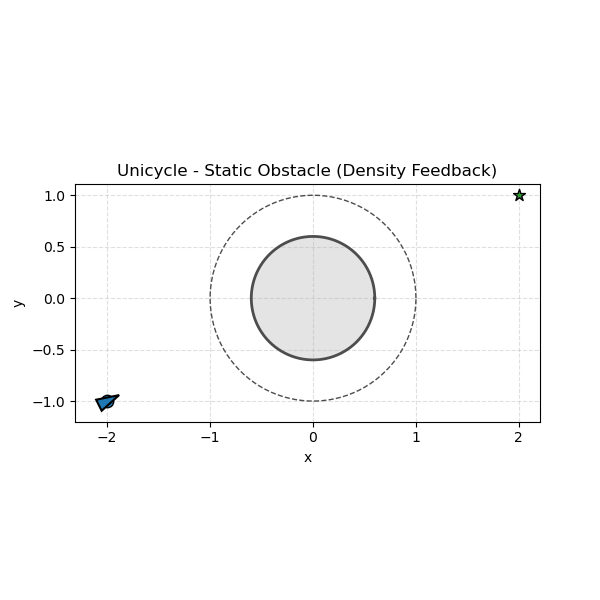

## Density Filter

The density filter first computes a nominal unicycle command
\(u_{\mathrm{nom}}\), then solves a one-step nonlinear safety filter.

Objective:

$$
\min_{u,s}
\frac{1}{2}\lVert u-u_{\mathrm{nom}}\rVert_W^2
+
\frac{1}{2}w_s\lVert s\rVert^2
$$

Subject to:

$$
\rho(z_{k+1})-\rho(z_k)
+
\Delta t\,\mathrm{div}(F_d)(z_k)\rho(z_k)
+
s
\ge 0
$$

$$
z_{k+1}=f_d(z_k,u_k)
$$

$$
u_{\min}\le u_k\le u_{\max},
\qquad
s\ge 0.
$$

For these unicycle examples, \(\mathrm{div}(F_d)=0\). The constraint evaluates
\(\rho(f_d(z,u))\), so this is generally a nonlinear filter rather than a
convex quadratic program.

Run:

```bash
python examples/unicycle/static_single_obstacle/density_filter.py --no-plot
```

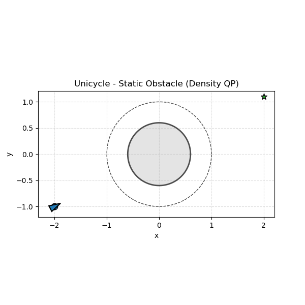

## Density MPC

The density MPC extends the density condition across a finite horizon. It solves
for

$$
U=
\begin{bmatrix}
u_0 & \cdots & u_{N-1}
\end{bmatrix},
\qquad
u_k=
\begin{bmatrix}
v_k & \omega_k
\end{bmatrix}^\top,
$$

with predicted dynamics

$$
z_{k+1}=f_d(z_k,u_k).
$$

For each prediction step, the MPC enforces the density transport condition

$$
\rho(z_{k+1})-\rho(z_k)
+
\Delta t\,\mathrm{div}(F_d)(z_k)\rho(z_k)
-
\Delta t\,C_k\rho(z_k)
\ge 0,
$$

where \(C_k\ge 0\) is a density-rate decision variable. This follows the
MPC-CDF style constraint used by the implementation. The objective uses the
same tuned goal, control, and control-rate costs as the CBF MPC comparison.

Run:

```bash
python examples/unicycle/static_single_obstacle/density_mpc.py --save-gif --horizon 7
```

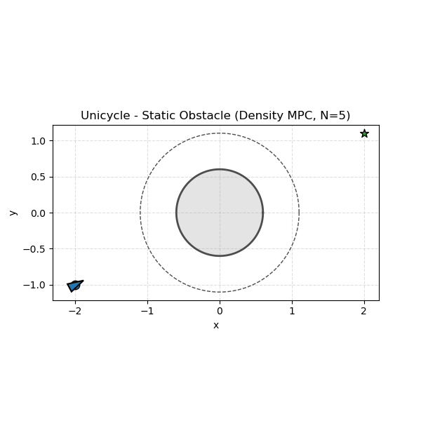

## CLF-CBF Filter

The one-step CLF-CBF filter uses a circular barrier around the inflated
obstacle:

$$
h(z)=\lVert p-p_o\rVert^2-R^2.
$$

The safe set is

$$
\mathcal{C}=\{z:h(z)\ge 0\}.
$$

The discrete-time CBF condition is

$$
h(z_{k+1})\ge (1-\gamma)h(z_k),
\qquad
\gamma\in(0,1].
$$

The goal-reaching CLF is

$$
V(z)=
\lVert p-p_g\rVert^2
+
w_\theta\,\mathrm{wrap}(\theta-\theta_g)^2.
$$

The relaxed one-step CLF condition is

$$
V(z_{k+1})-(1-c_{\mathrm{clf}})V(z_k)\le \delta,
\qquad
\delta\ge 0.
$$

The implemented filter solves

$$
\min_{u,\delta}
\frac{1}{2}\lVert u\rVert_W^2
+
\frac{1}{2}w_\delta\delta^2
$$

subject to the CBF condition, the relaxed CLF condition, and the control bounds.
The CBF slack is fixed to zero in the unicycle example, so the obstacle safety
constraint is hard.

Run:

```bash
python examples/unicycle/static_single_obstacle/clf_cbf_filter.py --no-plot
```

## Why One-Step CLF-CBF Parks At The Obstacle

For the Euler-discretized unicycle,

$$
p_{k+1} = p_k+\Delta t\,v_k
\begin{bmatrix}
\cos\theta_k\\
\sin\theta_k
\end{bmatrix}.
$$

The one-step circular CBF is

$$
h(z_{k+1}) =
\left\lVert
p_k+\Delta t\,v_k e(\theta_k)-p_o
\right\rVert^2
-R^2,
\qquad
e(\theta_k)=
\begin{bmatrix}
\cos\theta_k\\
\sin\theta_k
\end{bmatrix}.
$$

This expression depends on \(v_k\), but not on \(\omega_k\). The yaw-rate
changes \(\theta_{k+1}\), but it does not affect the next position under forward
Euler. Therefore the one-step CBF can slow down or stop the robot, but it cannot
directly steer around the obstacle.

The CLF can influence \(\omega_k\) through the heading term in \(V(z)\), but it
does not remove the one-step CBF relative-degree issue. In the static obstacle
comparison, the one-step CLF-CBF filter stays safe and parks at the obstacle
boundary:

```text
CLF-CBF filter final_dist=2.9808 min_clearance=0.0001 max_slack=0.00e+00
```

This is expected behavior. To make steering appear in the safety constraint, use
a two-step DCBF or a short-horizon MPC-CBF.

## CBF MPC

The CBF MPC applies the same discrete-time CBF constraint over a prediction
horizon:

$$
h(z_{k+j+1})\ge (1-\gamma)h(z_{k+j}),
\qquad
j=0,\ldots,N-1.
$$

Now \(\omega_k\) affects future headings and therefore future positions, so the
controller can steer around the obstacle. The unicycle static example uses hard
CBF constraints and the same goal, control, and control-rate costs as the
density MPC.

Run:

```bash
python examples/unicycle/static_single_obstacle/cbf_mpc.py --no-plot
```

## Density Controller Comparison

The density comparison runs density feedback, density filter, and density MPC:

```bash
python examples/unicycle/static_single_obstacle/compare_density_controllers.py --no-show
```

Current generated results:


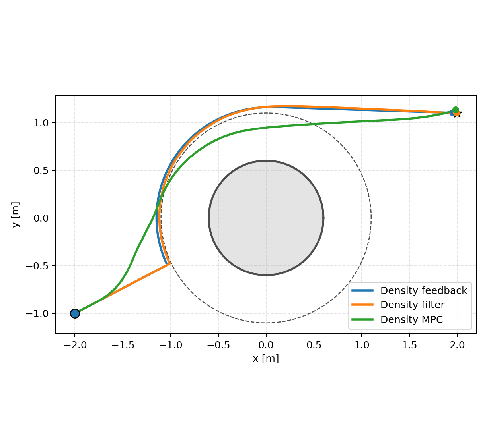

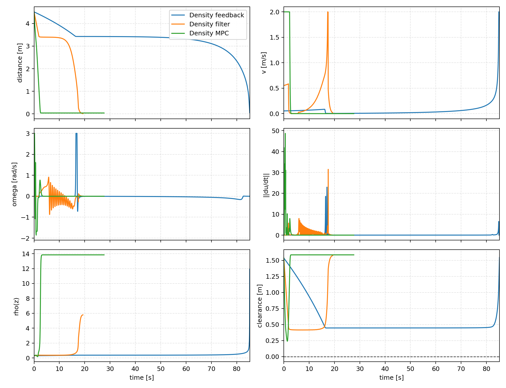

## Safety-Filter Comparison

The safety-filter comparison runs density filter, density MPC, one-step
CLF-CBF filter, and CBF MPC:

```bash
python examples/unicycle/static_single_obstacle/compare_safety_filters.py --no-show
```

The latest summary from the generated assets is:

```text
Density filter   steps=386  final_dist=0.0094 min_clearance=0.4148
Density MPC      steps=553  final_dist=0.0375 min_clearance=0.2402
CLF-CBF filter   steps=1000 final_dist=2.9808 min_clearance=0.0001
CBF MPC          steps=548  final_dist=0.0247 min_clearance=0.0000
```

The key qualitative result is that the one-step CLF-CBF filter is safe but
myopic, while the MPC-style controllers can use steering over the horizon.


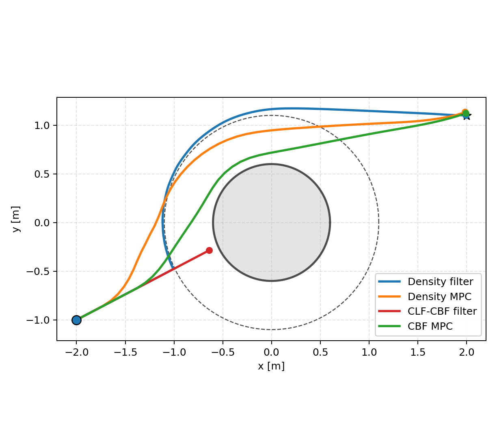

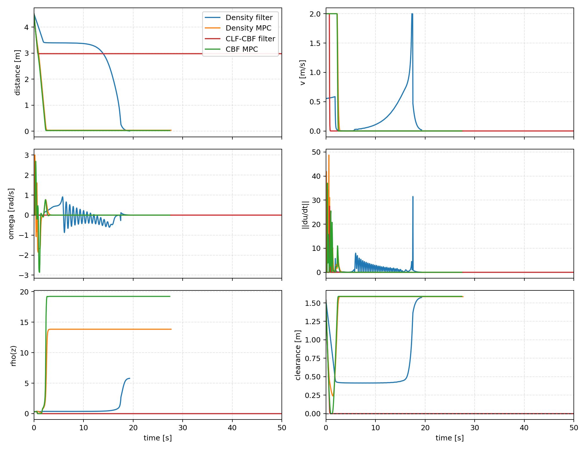

## Sensing-Radius Sweeps

The sensing-radius sweeps vary the outer obstacle radius \(r_2\) while keeping
the physical/safety radius fixed. The default values are:

```text
r2 = 0.95, 1.10, 1.25, 1.40, 1.50
```

Density feedback sweep:

```bash
python examples/unicycle/static_single_obstacle/density_feedback_sensing_radius_sweep.py --no-show
```

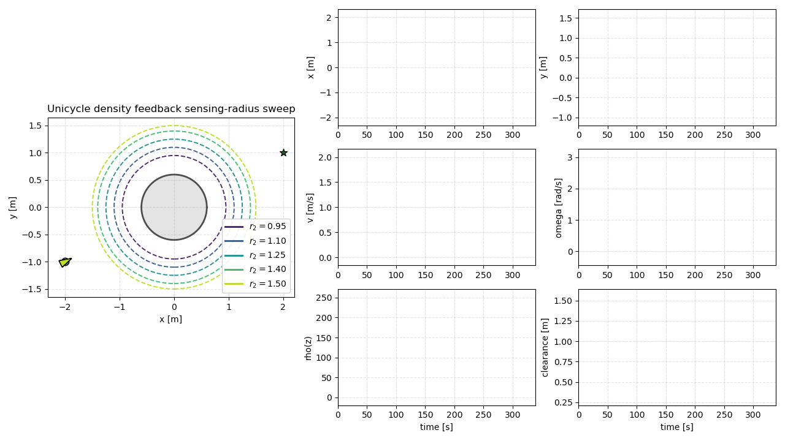

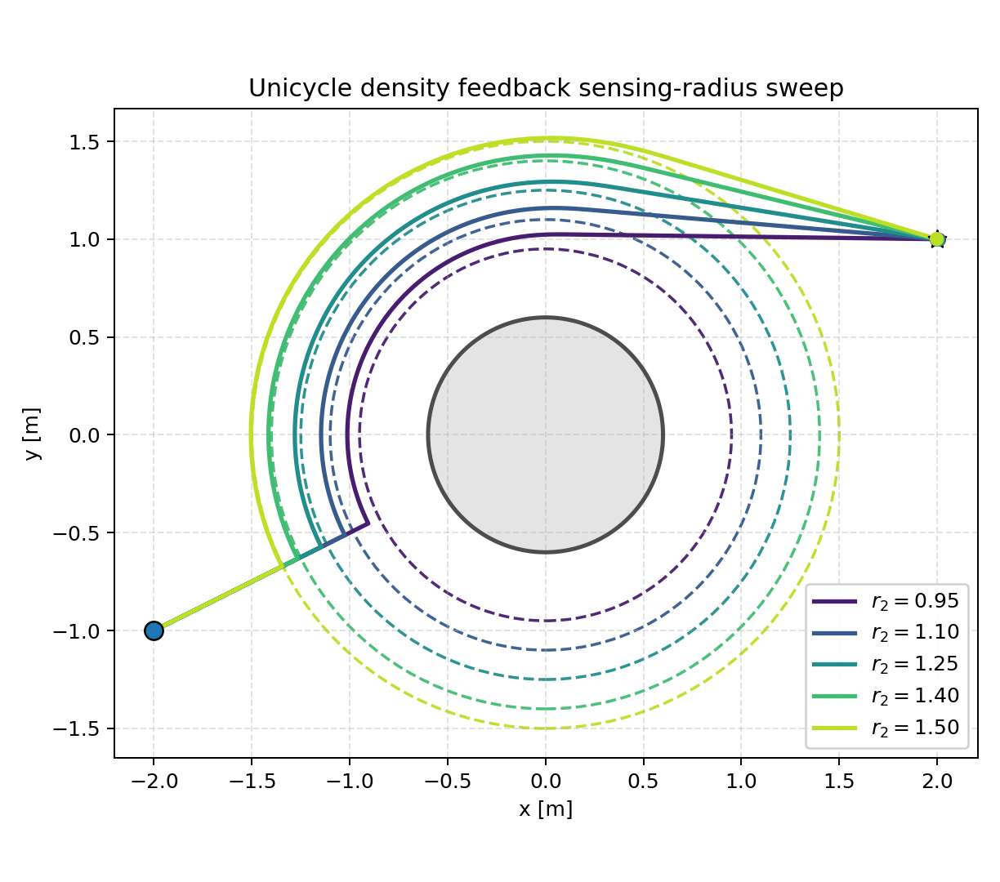

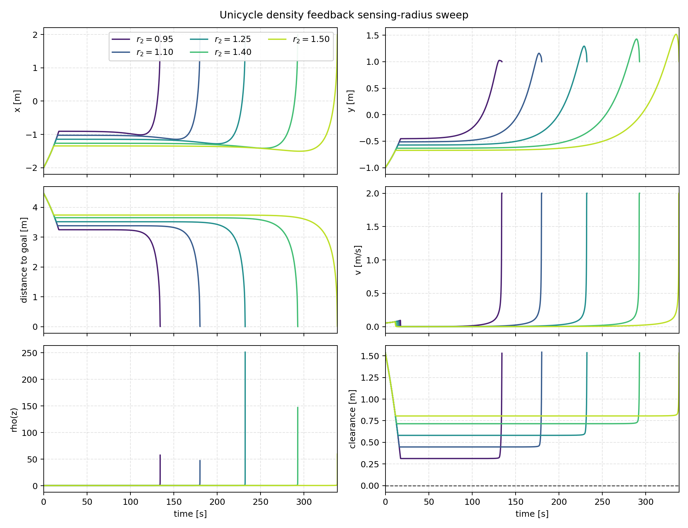

Density filter sweep:

```bash
python examples/unicycle/static_single_obstacle/density_filter_sensing_radius_sweep.py --no-show
```

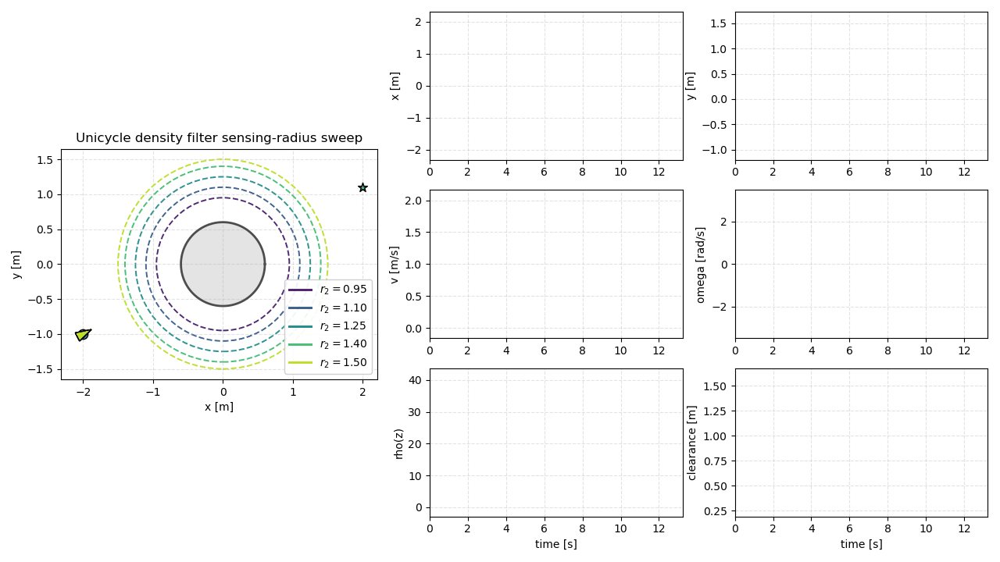

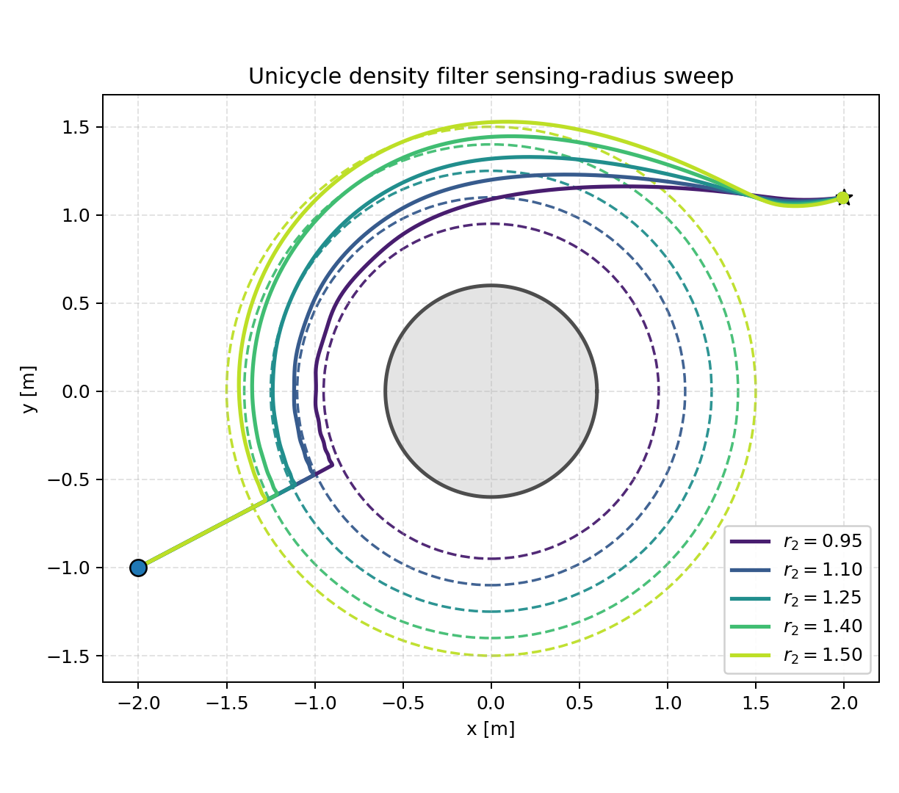

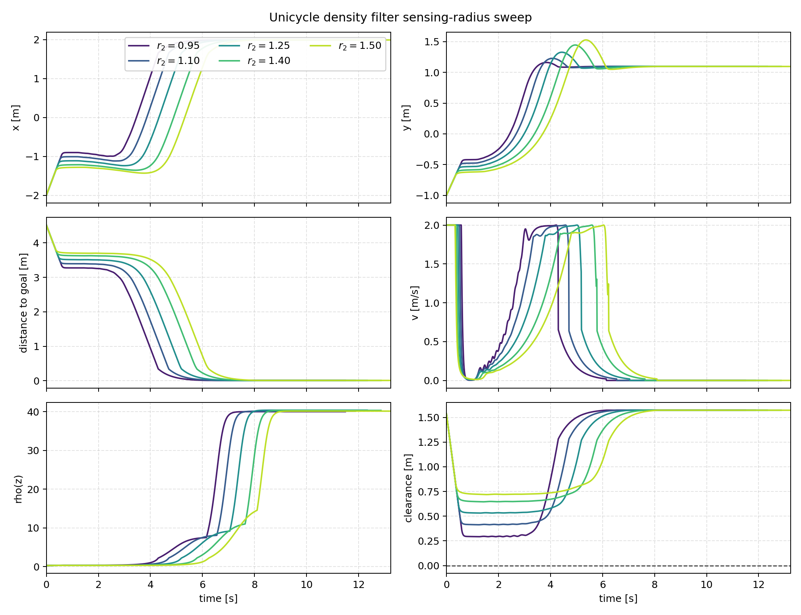

## Other Scenarios

The same density feedback/filter split exists in:

- `static_multi_obstacles/`
- `local_sensing/`

Both folders also include `density_mpc.py` for the horizon density-MPC version
of the corresponding scenario.

For example:

```bash
python examples/unicycle/static_multi_obstacles/density_feedback.py --save-gif
python examples/unicycle/static_multi_obstacles/density_filter.py --save-gif
python examples/unicycle/static_multi_obstacles/density_mpc.py --save-gif --horizon 7
python examples/unicycle/local_sensing/density_feedback.py --save-gif
python examples/unicycle/local_sensing/density_filter.py --save-gif
python examples/unicycle/local_sensing/density_mpc.py --save-gif --horizon 7
python examples/unicycle/local_sensing/density_filter_reactive_fov.py --save-gif
```

Use `--save-mp4` instead of, or alongside, `--save-gif` to write compact MP4
animations:

```bash
python examples/unicycle/local_sensing/density_mpc.py --save-mp4 --horizon 7 --no-plot
```
Static multi-obstacle results:

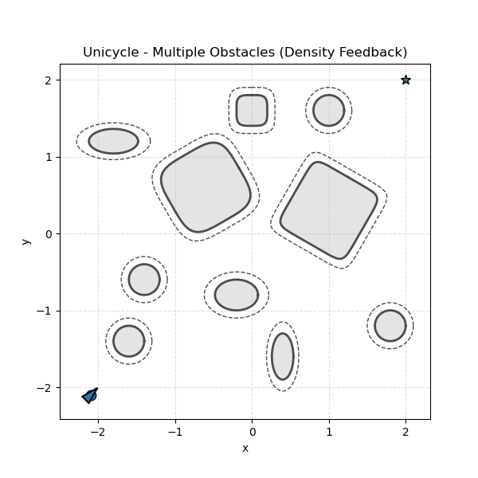

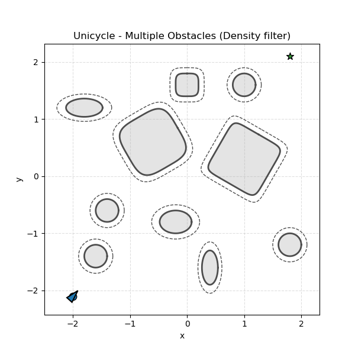


Local sensing results:

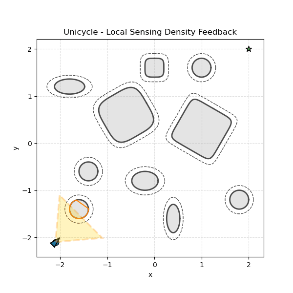

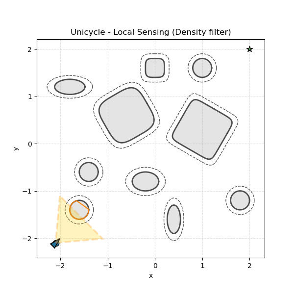

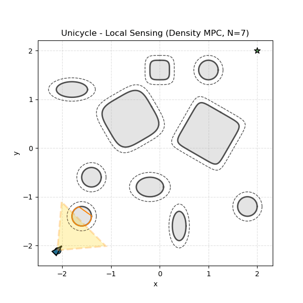

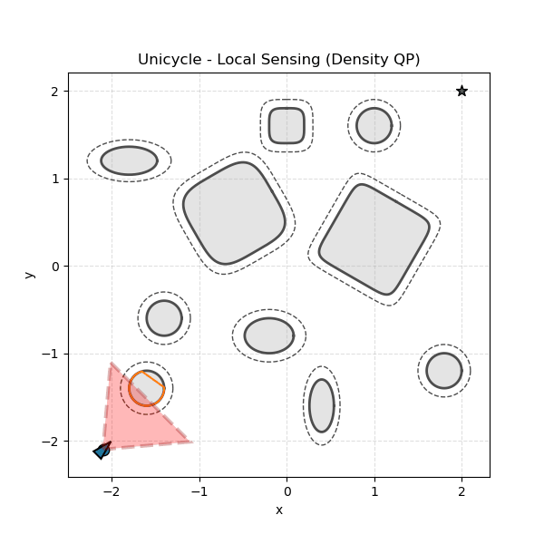

## Common Options

```bash
--save-gif        save a GIF animation
--save-mp4        save a compact MP4 animation
--mp4-crf N       tune MP4 size/quality; higher is smaller, default 28
--no-plot         skip interactive windows while still saving requested files
--no-show         save comparison outputs without opening matplotlib windows
--steps N         override maximum simulation steps
```

For quick non-visual checks:

```bash
python examples/unicycle/static_single_obstacle/density_filter.py --no-plot --steps 100
python examples/unicycle/static_single_obstacle/density_mpc.py --no-plot --steps 100
python examples/unicycle/static_single_obstacle/clf_cbf_filter.py --no-plot --steps 100
python examples/unicycle/static_single_obstacle/cbf_mpc.py --no-plot --steps 100
```
